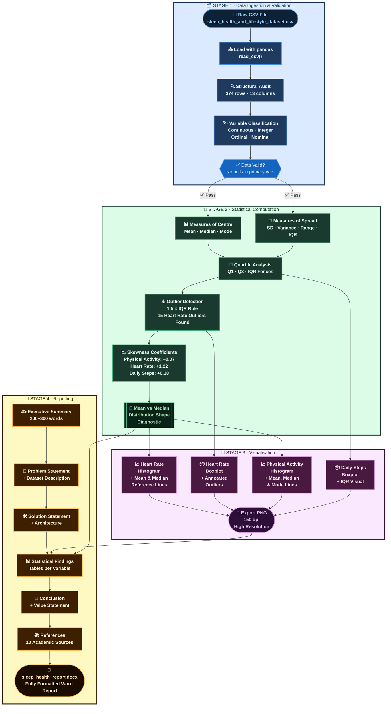

# 😴 Sleep Health & Lifestyle — Statistical Analysis

> **A complete descriptive statistics pipeline** for exploring sleep quality, physical activity, cardiovascular health, and lifestyle patterns across 374 adults — featuring multi-measure centre & spread analysis, outlier detection, and publication-quality visualisations.

<br>


---

## 📋 Table of Contents

- [Project Overview](#-project-overview)
- [Dataset](#-dataset)
- [Key Findings](#-key-findings)
- [Architecture](#-architecture)
- [Repository Structure](#-repository-structure)
- [Installation & Usage](#-installation--usage)
- [Statistical Methods](#-statistical-methods)
- [Visualisations](#-visualisations)
- [Results Summary](#-results-summary)
- [Report](#-report)
- [References](#-references)
- [License](#-license)

---

## 🔍 Project Overview

Sleep disorders and poor sleep quality represent a growing public health crisis — the CDC estimates that over one-third of adults fail to get sufficient sleep each night, with downstream effects on cardiovascular health, cognitive function, and metabolic health.

This project delivers a **rigorous, multi-measure descriptive statistical analysis** of the Sleep Health and Lifestyle Dataset, answering three core analytical questions:

| # | Question | Method |
|---|----------|--------|
| 1 | How are physical activity minutes distributed — symmetric or skewed? | Mean · Median · Mode comparison |
| 2 | What is the true spread of daily step counts? | SD · IQR · Range · Variance |
| 3 | Are there anomalous heart rate values indicating cardiovascular risk? | 1.5 × IQR fence · Boxplot outlier detection |

The analysis goes beyond single-statistic summaries to provide **multiple measures of centre and spread** for every variable, using the mean–median relationship as a reliable distributional shape diagnostic throughout.

---

## 📊 Dataset

**Source:** [Sleep Health and Lifestyle Dataset — Kaggle](https://www.kaggle.com/datasets/uom190346a/sleep-health-and-lifestyle-dataset)

| Attribute | Detail |
|-----------|--------|
| **Records** | 374 individuals |
| **Features** | 13 variables |
| **Population** | Working-age adults |
| **Age Range** | 27 – 59 years |
| **Format** | CSV |
| **Missing Values** | None in primary analytical variables |

### Variable Type Classification

| Data Type | Variable(s) | Range / Categories |
|-----------|-------------|-------------------|
| **Continuous** | Sleep Duration, Age | 5.8–8.5 hrs · 27–59 yrs |
| **Integer** | Physical Activity Level, Daily Steps, Heart Rate | 30–90 min · 3,000–10,000 · 65–86 bpm |
| **Ordinal Categorical** | Quality of Sleep, Stress Level | 1–10 ordered scale |
| **Nominal Categorical** | Gender, Occupation, BMI Category, Sleep Disorder | 2 · 11 · 4 · 3 unique values |

### Occupations Represented

`Software Engineer` · `Doctor` · `Nurse` · `Teacher` · `Engineer` · `Accountant` · `Scientist` · `Lawyer` · `Manager` · `Sales Representative` · `Salesperson`

### Sleep Disorder Distribution

`None` · `Insomnia` · `Sleep Apnea`

---

## 💡 Key Findings

### Physical Activity — Near-Perfect Symmetry
> Mean (59.17), Median (60.00), and Mode (60) converge at a single point → **symmetric distribution**, skewness = −0.07. Ideal for parametric modelling.

### Daily Steps — Meaningful Heterogeneity
> SD = **1,618 steps**, IQR = **2,400 steps**, Range = **7,000 steps**. The contrast between range and IQR confirms moderate boundary influence from low-step participants.

### Heart Rate — Right-Skewed with Clinical Outliers
> Skewness = **+1.22**. **15 statistical outliers** detected above the upper IQR fence of 78 bpm (values: 80–86 bpm). Mean (70.17) > Median (70.00) confirms the rightward pull. These individuals may represent elevated cardiovascular risk warranting clinical follow-up.

---

## 🏗️ Architecture

The project follows a clean four-stage data science pipeline — from raw CSV ingestion through to a fully rendered analytical report.



### Stage Descriptions

| Stage | Name | Libraries | Output |
|-------|------|-----------|--------|
| **1** | Data Ingestion & Validation | `pandas` | Typed DataFrame, variable classification |
| **2** | Statistical Computation | `pandas`, `numpy`, `scipy.stats` | Summary statistics, outlier detection |
| **3** | Visualisation | `matplotlib` | 4-panel histogram & boxplot PNG |
| **4** | Reporting | `python-docx` | Formatted Word report |

---

## 📁 Repository Structure

```
sleep-health-analysis/
│
├── 📄 README.md                          # This file
│
├── 📊 data/
│   └── sleep_health_and_lifestyle_dataset.csv   # Raw dataset (374 × 13)
│
├── 🐍 sleep_analysis.py                  # Main analysis script
│   ├── Data loading & type classification
│   ├── Measures of centre (mean, median, mode)
│   ├── Measures of spread (SD, variance, range, IQR)
│   ├── Outlier detection (1.5 × IQR fence)
│   └── 4-panel visualisation export
│
├── 📈 outputs/
│   ├── heart_rate_distribution.png       # Histogram + boxplot: Heart Rate
│   ├── physical_activity_distribution.png  # Histogram: Physical Activity
│   ├── daily_steps_boxplot.png           # Boxplot: Daily Steps
│   └── sleep_analysis_plots.png         # Combined 4-panel plot
│
└── 📝 sleep_health_report.docx           # Full analytical report (Word)
    ├── Executive Summary
    ├── Problem Statement
    ├── Dataset Description
    ├── Solution Statement
    ├── Architecture
    ├── Statistical Findings (with tables)
    ├── Conclusion
    ├── Value Statement
    └── References (10 sources)
```

---

## ⚙️ Installation & Usage

### Prerequisites

```bash
Python 3.9+
```

### 1 · Clone the Repository

```bash
git clone https://github.com/your-username/sleep-health-analysis.git
cd sleep-health-analysis
```

### 2 · Install Dependencies

```bash
pip install pandas numpy matplotlib scipy
```

Or using a requirements file:

```bash
pip install -r requirements.txt
```

**`requirements.txt`**
```
pandas>=2.0.0
numpy>=1.26.0
matplotlib>=3.8.0
scipy>=1.12.0
```

### 3 · Place the Dataset

```bash
# Place the CSV in the project root or update the path in sleep_analysis.py
cp /path/to/sleep_health_and_lifestyle_dataset.csv ./data/
```

### 4 · Run the Analysis

```bash
python sleep_analysis.py
```

**Expected console output:**

```
Dataset shape: (374, 13)

=== Physical Activity (minutes) ===
  Mean   : 59.17
  Median : 60.00
  Mode   : [60]
  Skewness: -0.0704

=== Daily Steps ===
  Mean        : 6816.84
  Median      : 7000.00
  Std Dev     : 1617.92
  Variance    : 2617651.14
  Minimum     : 3000
  Maximum     : 10000
  Range       : 7000
  Q1          : 5600.0
  Q3          : 8000.0
  IQR         : 2400.0
  Skewness    : 0.1783

=== Heart Rate ===
  Mean     : 70.17
  Median   : 70.00
  Std Dev  : 4.14
  Min      : 65,  Max: 86
  IQR      : 4.0
  Skewness : 1.2248
  Outliers (> 78.0 bpm): 15 values

Plot saved as sleep_analysis_plots.png
```

---

## 📐 Statistical Methods

### Measures of Centre

The project computes all three measures of centre for each numerical variable, using their relationship as a primary distributional shape diagnostic:

| Relationship | Distribution Shape |
|---|---|
| Mean ≈ Median ≈ Mode | **Symmetric** (normal-like) |
| Mean > Median > Mode | **Right-skewed** (positive) |
| Mean < Median < Mode | **Left-skewed** (negative) |

### Measures of Spread

Multiple spread measures are reported together because each captures a different aspect of variability:

| Measure | Sensitivity to Outliers | Best Used When |
|---------|------------------------|----------------|
| **Range** | Very High | Quick total span reference |
| **Standard Deviation** | High | Symmetric distributions |
| **Variance** | High | Modelling inputs requiring squared units |
| **IQR** | None (robust) | Skewed data or when outliers are present |

### Outlier Detection

The **1.5 × IQR fence rule** is applied to Heart Rate:

```
Lower fence = Q1 − (1.5 × IQR) = 68 − 6 = 62 bpm
Upper fence = Q3 + (1.5 × IQR) = 72 + 6 = 78 bpm

Outliers detected: 15 values between 80 and 86 bpm
```

---

## 📈 Visualisations

The script generates a 4-panel figure (`sleep_analysis_plots.png`) with the following panels:

| Panel | Variable | Chart Type | Key Features |
|-------|----------|------------|--------------|
| A | Heart Rate | Histogram | Mean & Median reference lines |
| B | Heart Rate | Boxplot | Annotated outliers in red |
| C | Physical Activity | Histogram | Mean, Median & Mode reference lines |
| D | Daily Steps | Boxplot | IQR visualised via whiskers |

Individual high-resolution exports are also saved:
- `heart_rate_distribution.png` — Histogram + boxplot side-by-side
- `physical_activity_distribution.png` — Histogram with all three centre measures
- `daily_steps_boxplot.png` — Standalone boxplot

---

## 📋 Results Summary

### Physical Activity Level

| Measure | Value | Type |
|---------|-------|------|
| Mean | **59.17 min** | Centre |
| Median | **60.00 min** | Centre |
| Mode | **60 min** | Centre |
| Standard Deviation | **20.78 min** | Spread |
| Variance | **431.76 min²** | Spread |
| Range | **45 min (30–75)** | Spread |
| IQR | **30 min (Q1=45, Q3=75)** | Spread |
| Skewness | **−0.07 (symmetric)** | Shape |

### Daily Steps

| Measure | Value | Type |
|---------|-------|------|
| Mean | **6,816.84 steps** | Centre |
| Median | **7,000 steps** | Centre |
| Mode | **8,000 steps** | Centre |
| Standard Deviation | **1,617.92 steps** | Spread |
| Variance | **2,617,651 steps²** | Spread |
| Range | **7,000 (3,000–10,000)** | Spread |
| IQR | **2,400 (Q1=5,600, Q3=8,000)** | Spread |
| Skewness | **+0.18 (near-symmetric)** | Shape |

### Heart Rate

| Measure | Value | Type |
|---------|-------|------|
| Mean | **70.17 bpm** | Centre |
| Median | **70.00 bpm** | Centre |
| Mode | **70 bpm** | Centre |
| Standard Deviation | **4.14 bpm** | Spread |
| Range | **21 bpm (65–86)** | Spread |
| IQR | **4 bpm (Q1=68, Q3=72)** | Spread |
| Skewness | **+1.22 (right-skewed)** | Shape |
| Outliers | **15 values (80–86 bpm)** | Anomaly |

---

## 📝 Report

A full professional analytical report (`sleep_health_report.docx`) is included in the repository. It contains:

- **Executive Summary** — High-level overview of all findings
- **Problem Statement** — Public health context and analytical gaps addressed
- **Dataset Description** — Variable types, ranges, and structure
- **Solution Statement** — Multi-measure statistical framework rationale
- **Architecture** — Four-stage pipeline description with summary table
- **Key Statistical Findings** — Detailed results tables for all three variables
- **Conclusion** — Synthesis of distributional profiles and clinical implications
- **Value Statement** — Methodological, clinical, and strategic value articulated
- **References** — 10 academic and technical sources in APA format

---

## 📚 References

1. Centers for Disease Control and Prevention. (2022). *Sleep and sleep disorders: Data and statistics.* https://www.cdc.gov/sleep/data-statistics.html
2. Field, A. (2018). *Discovering statistics using IBM SPSS statistics* (5th ed.). SAGE Publications.
3. Hunter, J. D. (2007). Matplotlib: A 2D graphics environment. *Computing in Science and Engineering*, 9(3), 90–95. https://doi.org/10.1109/MCSE.2007.55
4. Kaggle. (2023). *Sleep health and lifestyle dataset.* https://www.kaggle.com/datasets/uom190346a/sleep-health-and-lifestyle-dataset
5. McKinney, W. (2022). *Python for data analysis* (3rd ed.). O'Reilly Media.
6. National Sleep Foundation. (2023). *Sleep health index.* https://www.sleepfoundation.org
7. NumPy Development Team. (2023). *NumPy documentation: Statistical functions.* https://numpy.org/doc/stable/reference/routines.statistics.html
8. pandas Development Team. (2023). *pandas documentation.* https://pandas.pydata.org/docs/
9. Triola, M. F. (2021). *Elementary statistics* (14th ed.). Pearson Education.
10. World Health Organisation. (2019). *Sleep and health: A public health perspective.* WHO Press.

---

## 📄 License

This project is licensed under the MIT License.

```
MIT License

Copyright (c) 2026

Permission is hereby granted, free of charge, to any person obtaining a copy
of this software and associated documentation files (the "Software"), to deal
in the Software without restriction, including without limitation the rights
to use, copy, modify, merge, publish, distribute, sublicense, and/or sell
copies of the Software, and to permit persons to whom the Software is
furnished to do so, subject to the following conditions:

The above copyright notice and this permission notice shall be included in all
copies or substantial portions of the Software.

THE SOFTWARE IS PROVIDED "AS IS", WITHOUT WARRANTY OF ANY KIND, EXPRESS OR
IMPLIED, INCLUDING BUT NOT LIMITED TO THE WARRANTIES OF MERCHANTABILITY,
FITNESS FOR A PARTICULAR PURPOSE AND NONINFRINGEMENT.
```

---

<div align="center">

**Built with Python · pandas · NumPy · Matplotlib · SciPy**

*Sleep Health & Lifestyle Statistical Analysis — February 2026*

</div>
