# Analysis of A/B Test Results
### E-Commerce Conversion Rate Experiment · Udacity Data Scientist Nanodegree

<div align="center">


</div>

---

## Table of Contents

- [Project Overview](#-project-overview)
- [Key Results](#-key-results)
- [Dataset](#-dataset)
- [Project Structure](#-project-structure)
- [Architecture](#-architecture)
- [Installation & Setup](#-installation--setup)
- [Usage](#-usage)
- [Analysis Walkthrough](#-analysis-walkthrough)
  - [Part I — Descriptive Statistics](#part-i--descriptive-statistics)
  - [Part II — Probability Analysis](#part-ii--probability-analysis)
  - [Part III — Hypothesis Testing](#part-iii--hypothesis-testing)
  - [Standout — Logistic Regression](#standout--logistic-regression)
- [Results Summary](#-results-summary)
- [Deliverables](#-deliverables)
- [Technologies Used](#-technologies-used)
- [References](#-references)

---

## Project Overview

This project analyzes the results of an **A/B test** run by an e-commerce company that designed a new web page to increase the proportion of users who **convert** (i.e., decide to pay for the company's product).

The analysis addresses three possible business decisions:

| Decision | Condition |
|----------|-----------|
| ✅ **Implement** the new treatment page | Strong statistical evidence of higher conversion |
| ❌ **Keep** the old control page | No meaningful difference detected |
| ⏳ **Extend** the experiment | Insufficient evidence — ambiguous result |

The project moves through **descriptive statistics → conditional probability → simulation-based hypothesis testing → logistic regression**, building a multi-layered evidentiary case for the final recommendation.

> **Verdict:** The treatment page converts at **15.53%** vs **10.53%** for control — a **+5.01 pp / +47.6% relative lift** — with a p-value of **≈ 0.000**. The recommendation is to **implement the new page immediately**.

---

## Key Results

<div align="center">

| Metric | Value |
|--------|-------|
| 👥 Total Users | **69,889** |
| 🎯 Overall Conversion Rate | **13.05%** |
| 🔵 Control Conversion Rate | **10.53%** |
| 🟢 Treatment Conversion Rate | **15.53%** |
| 📈 Absolute Lift | **+5.01 percentage points** |
| 📊 Relative Lift | **+47.6%** |
| 🔬 p-value | **≈ 0.000** |
| ✅ Significance Level (α) | **0.05** |
| 🧮 Null Hypothesis Decision | **REJECTED** |
| 🌍 Geographic Confounding | **None detected** |

</div>

---

## Dataset

**File:** `ab_data.csv`

The dataset contains **69,889 rows** with **no missing values**, representing unique user sessions during the experiment.

| Column | Type | Description | Values |
|--------|------|-------------|--------|
| `country` | `str` (categorical) | User's country of origin | `US`, `UK`, `CA` |
| `group` | `str` (categorical) | Experimental condition assigned | `control`, `treatment` |
| `converted` | `int64` (binary) | Whether the user made a purchase | `0` (no), `1` (yes) |

### Geographic Distribution

| Country | Count | Share |
|---------|-------|-------|
| 🇺🇸 United States | 48,850 | 69.9% |
| 🇬🇧 United Kingdom | 17,551 | 25.1% |
| 🇨🇦 Canada | 3,488 | 5.0% |

### Group Balance

| Group | n | Share |
|-------|---|-------|
| Control | 34,678 | 49.6% |
| Treatment | 35,211 | 50.4% |

> The near-equal 50/50 split confirms proper randomisation in the experimental design.

---

##  Project Structure

```
ab-test-analysis/
│
├── 📄 ab_data.csv                              # Raw experimental dataset (69,889 records)
│
├── 📓 analyze_ab_test_results_completed.ipynb  # Executed Jupyter notebook (all outputs embedded)
├── 🌐 analyze_ab_test_results_completed.html   # Rendered HTML version of the notebook
├── 🐍 analyze_ab_test_results_completed.py     # Standalone Python script (fully commented)
│
├── 📊 ab_test_analysis.pptx                    # 6-slide PowerPoint presentation
├── 📝 ab_test_report.docx                      # Comprehensive Word project report (11 pages)
│
└── 📖 README.md                                # This file
```

---

## 🏗 Architecture

The analytical pipeline is structured as five modular stages, each with clearly defined inputs, processes, and outputs. A fixed random seed (`0`) ensures full reproducibility across all runs.

```mermaid
flowchart TD
    %% ── DATA LAYER ──────────────────────────────────────────────────────
    subgraph DATA["🗄️  DATA LAYER"]
        direction TB
        A1["📂 ab_data.csv\n69,889 rows · 3 columns"]
        A2["🔍 Data Quality Check\nNull values · Dtypes · Duplicates"]
        A1 --> A2
    end

    %% ── MODULE 1 — DESCRIPTIVE STATISTICS ───────────────────────────────
    subgraph MOD1["📊  MODULE 1 — Descriptive Statistics"]
        direction TB
        B1["df.shape\n→ 69,889 rows"]
        B2["df['converted'].mean()\n→ 13.05% overall rate"]
        B3["df.isnull().sum()\n→ 0 missing values"]
        B4["df['country'].value_counts()\n→ US · UK · CA counts"]
        B5["📈 Bar Chart\nCountry Distribution"]
        B1 & B2 & B3 & B4 --> B5
    end

    %% ── MODULE 2 — PROBABILITY ANALYSIS ─────────────────────────────────
    subgraph MOD2["🎲  MODULE 2 — Probability Analysis"]
        direction TB
        C1["P(converted)\n→ 0.1305"]
        C2["P(converted | control)\n→ 0.1053"]
        C3["P(converted | treatment)\n→ 0.1553"]
        C4["P(converted | country)\nUS · UK · CA rates"]
        C5["2×3 Conversion Table\nGroup × Country"]
        C1 & C2 & C3 & C4 --> C5
    end

    %% ── MODULE 3 — HYPOTHESIS TESTING ───────────────────────────────────
    subgraph MOD3["🔬  MODULE 3 — Hypothesis Testing"]
        direction TB
        D1["H₀: p_treatment − p_control ≤ 0\nH₁: p_treatment − p_control > 0"]
        D2["Null Parameters\np_null = 0.1305\nn_treatment = 35,211\nn_control = 34,678"]
        D3["Bootstrap Simulation\n500 iterations\nnp.random.binomial()"]
        D4["Observed Δ = +0.0501\n(5.01 percentage points)"]
        D5["p-value = 0.000\np < α (0.05)"]
        D6["✅ REJECT H₀\nImplement treatment page"]
        D1 --> D2 --> D3
        D4 --> D5 --> D6
        D3 --> D5
    end

    %% ── MODULE 4 — LOGISTIC REGRESSION ──────────────────────────────────
    subgraph MOD4["🤖  MODULE 4 — Logistic Regression"]
        direction TB
        E1["Feature Engineering\ntreatment: binary encode\ncountry: LabelEncoder"]
        E2["LogisticRegression\nfit(X, y)"]
        E3["Coef: treatment = +0.446\nOdds Ratio = 1.56 (56% lift)"]
        E4["Coef: country = +0.051\n≈ 0 → not confounding"]
        E5["✅ Treatment Effect\nGeographically Consistent"]
        E1 --> E2 --> E3 & E4 --> E5
    end

    %% ── OUTPUTS LAYER ────────────────────────────────────────────────────
    subgraph OUT["📦  OUTPUTS"]
        direction LR
        F1["📓 .ipynb\nExecuted Notebook"]
        F2["🌐 .html\nRendered Report"]
        F3["📊 .pptx\n6-Slide Deck"]
        F4["📝 .docx\n11-Page Report"]
        F5["🐍 .py\nStandalone Script"]
    end

    %% ── FLOW CONNECTIONS ─────────────────────────────────────────────────
    A2 --> MOD1
    MOD1 --> MOD2
    MOD2 --> MOD3
    MOD3 --> MOD4
    MOD4 --> OUT

    %% ── STYLES ───────────────────────────────────────────────────────────
    classDef dataStyle    fill:#0D3B66,stroke:#1A6BAA,color:#E8F4FD,font-weight:bold
    classDef mod1Style    fill:#1A5276,stroke:#2980B9,color:#D6EAF8,font-weight:bold
    classDef mod2Style    fill:#145A32,stroke:#27AE60,color:#D5F5E3,font-weight:bold
    classDef mod3Style    fill:#4A235A,stroke:#8E44AD,color:#E8DAEF,font-weight:bold
    classDef mod4Style    fill:#7B3F00,stroke:#D35400,color:#FDEBD0,font-weight:bold
    classDef outStyle     fill:#1B2631,stroke:#839192,color:#EAECEE,font-weight:bold
    classDef subDataStyle fill:#0A2F4A,stroke:#1A6BAA,color:#AED6F1
    classDef subMod1Style fill:#154360,stroke:#2980B9,color:#AED6F1
    classDef subMod2Style fill:#0E4024,stroke:#27AE60,color:#A9DFBF
    classDef subMod3Style fill:#3B1A4A,stroke:#8E44AD,color:#D7BDE2
    classDef subMod4Style fill:#6E2C00,stroke:#D35400,color:#FAD7A0
    classDef subOutStyle  fill:#17202A,stroke:#839192,color:#CCD1D1

    class A1,A2 dataStyle
    class B1,B2,B3,B4,B5 mod1Style
    class C1,C2,C3,C4,C5 mod2Style
    class D1,D2,D3,D4,D5,D6 mod3Style
    class E1,E2,E3,E4,E5 mod4Style
    class F1,F2,F3,F4,F5 outStyle

    style DATA fill:#0A2240,stroke:#1A6BAA,color:#AED6F1,font-weight:bold
    style MOD1 fill:#0D2E4E,stroke:#2980B9,color:#AED6F1,font-weight:bold
    style MOD2 fill:#0B3322,stroke:#27AE60,color:#A9DFBF,font-weight:bold
    style MOD3 fill:#2C1040,stroke:#8E44AD,color:#D7BDE2,font-weight:bold
    style MOD4 fill:#4A1A00,stroke:#D35400,color:#FAD7A0,font-weight:bold
    style OUT  fill:#111A22,stroke:#839192,color:#CCD1D1,font-weight:bold
```



### Pipeline Summary

| Stage | Module | Key Tools | Output |
|-------|--------|-----------|--------|
| 1️⃣ | **Data Ingestion & Quality** | `pd.read_csv`, `isnull`, `dtypes` | Validated DataFrame |
| 2️⃣ | **Descriptive Statistics** | `value_counts`, `mean`, `matplotlib` | Summary metrics + bar chart |
| 3️⃣ | **Probability Analysis** | `groupby`, `query`, `mean` | 2×3 conversion rate table |
| 4️⃣ | **Hypothesis Testing** | `np.random.binomial`, simulation loop | p-value, reject/fail-to-reject |
| 5️⃣ | **Logistic Regression** | `LogisticRegression`, `LabelEncoder` | Coefficients, odds ratios |

---

##  Installation & Setup

### Prerequisites

- Python 3.10 or higher
- pip package manager

### 1. Clone the Repository

```bash
git clone https://github.com/your-username/ab-test-analysis.git
cd ab-test-analysis
```

### 2. Create a Virtual Environment (recommended)

```bash
python -m venv venv
source venv/bin/activate        # macOS / Linux
venv\Scripts\activate           # Windows
```

### 3. Install Dependencies

```bash
pip install pandas numpy matplotlib scikit-learn jupyter nbformat nbconvert
```

Or install from a requirements file:

```bash
pip install -r requirements.txt
```

**`requirements.txt`**
```
pandas>=2.0.0
numpy>=1.26.0
matplotlib>=3.8.0
scikit-learn>=1.4.0
jupyter>=1.0.0
nbformat>=5.9.0
nbconvert>=7.0.0
```

### 4. Verify Installation

```bash
python -c "import pandas, numpy, matplotlib, sklearn; print('All dependencies OK')"
```

---

## 🚀 Usage

### Option A — Run the Jupyter Notebook (recommended)

```bash
jupyter notebook analyze_ab_test_results_completed.ipynb
```

Open in your browser and run all cells sequentially (`Kernel → Restart & Run All`).

### Option B — Run the Python Script

```bash
python analyze_ab_test_results_completed.py
```

This produces all printed outputs and displays all matplotlib plots inline.

### Option C — View the Pre-Executed HTML Report

Open `analyze_ab_test_results_completed.html` in any web browser. All outputs, tables, and charts are already embedded — no Python environment required.

---

## Analysis Walkthrough

### Part I — Descriptive Statistics

Establishes a factual baseline understanding of the dataset before any inferential work.

```python
import pandas as pd
import numpy as np
import random
import matplotlib.pyplot as plt

random.seed(0)

df = pd.read_csv('ab_data.csv')

# b) Row count
print(df.shape)              # (69889, 3)

# c) Conversion rate
print(df['converted'].mean()) # 0.1305

# d) Missing values
print(df.isnull().sum())      # 0 for all columns

# e) Country distribution
print(df['country'].value_counts())
# US    48850
# UK    17551
# CA     3488
```

**Key findings:**
- 69,889 total records with **zero missing values**
- Overall conversion rate: **13.05%**
- `converted` is the only numeric (non-categorical) column — binary integer (0/1)
- US dominates the sample at nearly 70% of all users

---

### Part II — Probability Analysis

Derives conditional probabilities to understand how group and country relate to conversion.

```python
# Overall P(converted)
p_overall = df['converted'].mean()                              # 0.1305

# P(converted | control)
p_control = df.query('group == "control"')['converted'].mean() # 0.1053

# P(converted | treatment)
p_treatment = df.query('group == "treatment"')['converted'].mean() # 0.1553

# Conversion table: country × group
df.groupby(['country', 'group'])['converted'].mean().unstack()
```

**Conversion Rate Table (2×3 matrix):**

|  | 🇺🇸 US | 🇬🇧 UK | 🇨🇦 CA |
|--|--------|--------|--------|
| **Control** | 10.7% | 10.2% | 9.4% |
| **Treatment** | 15.8% | 14.9% | 15.4% |
| **Lift** | +5.1 pp | +4.7 pp | +6.0 pp |

> **Insight:** The treatment lift is remarkably consistent across all three countries (~5–6 pp), strongly suggesting the effect is genuine and not geographic sampling bias.

---

### Part III — Hypothesis Testing

Formal one-tailed simulation-based test at α = 0.05.

**Hypotheses:**

```
H₀: p_treatment − p_control ≤ 0   (control is at least as good)
H₁: p_treatment − p_control >  0   (treatment is better)
```

```python
np.random.seed(0)

# Null hypothesis parameters
p_null      = df['converted'].mean()                        # 0.1305
n_treatment = df.query('group == "treatment"').shape[0]     # 35,211
n_control   = df.query('group == "control"').shape[0]       # 34,678

# Bootstrap simulation — 500 iterations under H₀
p_diffs = []
for _ in range(500):
    t = np.random.binomial(1, p_null, n_treatment)
    c = np.random.binomial(1, p_null, n_control)
    p_diffs.append(t.mean() - c.mean())

p_diffs = np.array(p_diffs)

# Observed difference
obs_diff = p_treatment - p_control   # +0.0501

# p-value
p_value = (p_diffs >= obs_diff).mean()
print(f"p-value: {p_value}")         # 0.000
```

**Result:** `p ≈ 0.000 < α = 0.05` → **Reject H₀**

The sampling distribution under the null is bell-shaped and centred near 0. The observed difference of **+5.01 pp** lies entirely outside the null distribution — none of the 500 simulated null differences came close to exceeding it.

---

### Standout — Logistic Regression

Model-based confirmation that the treatment effect is real and not geographically confounded.

```python
from sklearn.linear_model import LogisticRegression
from sklearn.preprocessing import LabelEncoder

df_lr = df.copy()
df_lr['treatment']   = (df_lr['group'] == 'treatment').astype(int)
df_lr['country_enc'] = LabelEncoder().fit_transform(df_lr['country'])

X = df_lr[['treatment', 'country_enc']]
y = df_lr['converted']

model = LogisticRegression()
model.fit(X, y)

print(f"Treatment coef:  {model.coef_[0][0]:.4f}")  # +0.4456
print(f"Country coef:    {model.coef_[0][1]:.4f}")  # +0.0510
print(f"Odds ratio:      {np.exp(model.coef_[0][0]):.4f}")  # 1.5615
print(f"Accuracy:        {model.score(X, y):.4f}")  # 0.8695
```

**Logistic Regression Findings:**

| Predictor | Log-Odds Coef | Odds Ratio | Interpretation |
|-----------|--------------|------------|----------------|
| **Treatment** | +0.446 | **1.56** | Treatment users are **56% more likely** to convert |
| **Country** | +0.051 | 1.05 | Country has **negligible** impact on conversion |

> **Conclusion:** Treatment group membership — not geography — drives conversion. Country is confirmed as a **non-confounding variable**, validating the hypothesis test and supporting a single global page rollout.

---

## Results Summary

```
┌─────────────────────────────────────────────────────────────────┐
│                    EXPERIMENT RESULTS                           │
├─────────────────────────────┬───────────────────────────────────┤
│  Treatment Conversion Rate  │  15.53%                           │
│  Control Conversion Rate    │  10.53%                           │
│  Observed Δ                 │  +5.01 pp  (+47.6% relative)      │
│  Bootstrap p-value          │  ≈ 0.000                          │
│  Significance threshold α   │  0.05                             │
│  Decision                   │  ✅ REJECT H₀                     │
├─────────────────────────────┴───────────────────────────────────┤
│  LR Treatment Coef          │  +0.446 (OR = 1.56)               │
│  LR Country Coef            │  +0.051  ← not confounding        │
│  Recommendation             │  🚀 IMPLEMENT the new page        │
└─────────────────────────────────────────────────────────────────┘
```

---

## Deliverables

| File | Format | Description |
|------|--------|-------------|
| `analyze_ab_test_results_completed.ipynb` | Jupyter Notebook | Fully executed with all outputs embedded |
| `analyze_ab_test_results_completed.html` | HTML | Browser-viewable rendered notebook |
| `analyze_ab_test_results_completed.py` | Python Script | Standalone script with docstrings and comments |
| `ab_test_analysis.pptx` | PowerPoint | 6-slide presentation deck |
| `ab_test_report.docx` | Word Document | 11-page comprehensive project report |
| `README.md` | Markdown | This file |

---

## Technologies Used

| Category | Technology | Version | Purpose |
|----------|------------|---------|---------|
| **Language** | Python | 3.10+ | Core analysis language |
| **Data** | pandas | 3.0 | Data ingestion, filtering, groupby |
| **Numerical** | NumPy | 1.26 | Binomial simulation, array ops |
| **Visualisation** | Matplotlib | 3.8 | Bar charts, histograms |
| **ML** | scikit-learn | 1.4 | Logistic regression, encoding |
| **Notebook** | Jupyter | 1.0 | Interactive development |
| **Export** | nbconvert | 7.0 | Notebook → HTML execution |
| **Presentation** | PptxGenJS | 8.x | PowerPoint generation |
| **Report** | docx (npm) | 9.x | Word document generation |

---

## References

1. **Udacity.** (2024). *Statistics for Data Analysis Nanodegree: Hypothesis Testing Module.* https://www.udacity.com/course/data-scientist-nanodegree--nd025

2. **Kohavi, R., Tang, D., & Xu, Y.** (2020). *Trustworthy Online Controlled Experiments: A Practical Guide to A/B Testing.* Cambridge University Press. https://doi.org/10.1017/9781108653985

3. **McKinney, W.** (2022). *Python for Data Analysis: Data Wrangling with pandas, NumPy, and Jupyter* (3rd ed.). O'Reilly Media.

4. **Pedregosa, F., et al.** (2011). Scikit-learn: Machine learning in Python. *Journal of Machine Learning Research, 12,* 2825–2830. https://jmlr.org/papers/v12/pedregosa11a.html

5. **VanderPlas, J.** (2016). *Python Data Science Handbook.* O'Reilly Media. https://jakevdp.github.io/PythonDataScienceHandbook/

6. **Harris, C. R., et al.** (2020). Array programming with NumPy. *Nature, 585,* 357–362. https://doi.org/10.1038/s41586-020-2649-2

7. **Hunter, J. D.** (2007). Matplotlib: A 2D graphics environment. *Computing in Science & Engineering, 9*(3), 90–95. https://doi.org/10.1109/MCSE.2007.55

8. **Kohavi, R., & Longbotham, R.** (2017). Online controlled experiments and A/B testing. *Encyclopedia of Machine Learning and Data Mining,* 922–929. https://doi.org/10.1007/978-1-4899-7687-1_891

9. **pandas Development Team.** (2024). *pandas documentation (v3.0).* https://pandas.pydata.org/docs/

10. **Georgiev, G. Z.** (2019). *Statistical Methods in Online A/B Testing.* Independently published.

---

## License

This project is submitted as part of the **Udacity Data Scientist Nanodegree** programme. The dataset and project structure are provided by Udacity. Original analysis code and documentation are released under the [MIT License](LICENSE).

---

<div align="center">

**Built with Python · pandas · scikit-learn · Jupyter**

*Udacity Data Scientist Nanodegree — 2025*

</div>


