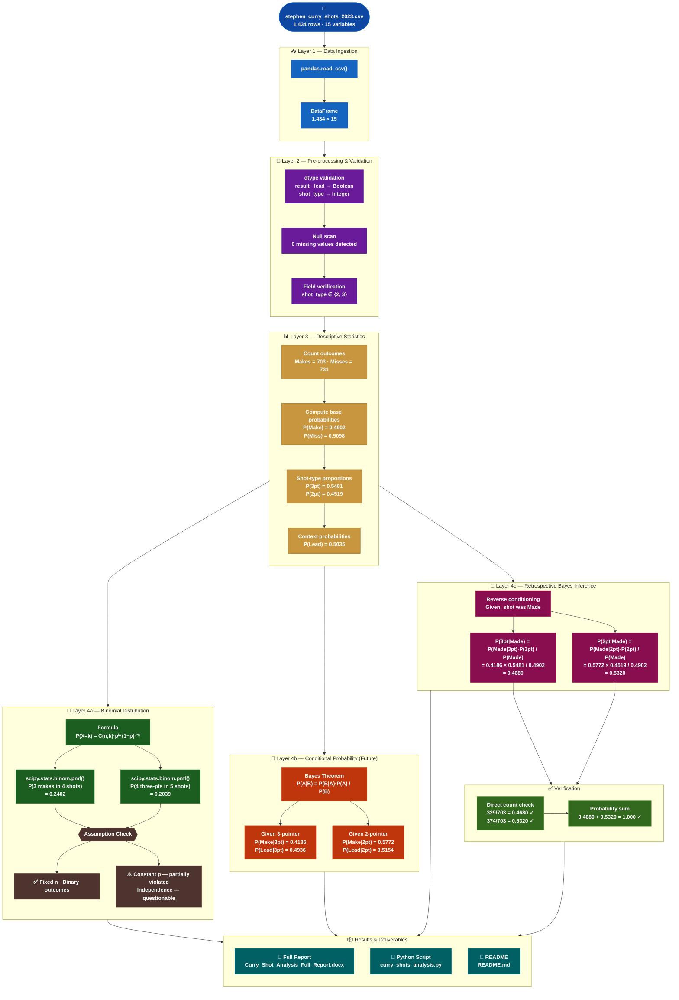

# 🏀 Stephen Curry Shot Analysis
### Probability & Conditional Probability Analysis — 2022-2023 NBA Season

<div align="center">


</div>

---

## 📋 Table of Contents

- [Executive Summary](#-executive-summary)
- [Problem Statement](#-problem-statement)
- [Dataset](#-dataset)
- [Solution Statement](#-solution-statement)
- [Architecture](#-architecture)
- [Key Results](#-key-results)
- [Statistical Methods](#-statistical-methods)
- [Project Structure](#-project-structure)
- [Installation & Usage](#-installation--usage)
- [Conclusion](#-conclusion)
- [Value Statement](#-value-statement)
- [References](#-references)

---

## 📌 Executive Summary

This project presents a **comprehensive statistical analysis** of Stephen (Steph) Curry's field-goal shooting performance during the 2022-2023 NBA regular season. Using a dataset of **1,434 shot attempts** recorded across the full season, the project applies three core probabilistic frameworks — descriptive statistics, binomial probability, and Bayes' Theorem — to quantify Curry's scoring behaviour and derive forward-looking and retrospective conditional insights.

The analysis establishes that Curry converted **49.02%** of all attempts, with a notably higher success rate on two-point shots (**57.72%**) compared to three-point shots (**41.86%**). Despite this discrepancy, Curry attempted three-pointers at a significantly higher rate (54.81% of all shots), reflecting his well-documented offensive strategy as one of the greatest long-range shooters in NBA history.

Binomial probability modelling reveals:
- The likelihood of making **exactly 3 of 4** consecutive shots ≈ **24.02%**
- The probability of logging **4 three-pointers in 5 attempts** ≈ **20.39%**

Conditional probability analysis via **Bayes' Theorem** reveals that when Curry shoots a three-pointer, his team holds a lead on approximately 49.36% of those attempts, versus 51.54% on two-point attempts. Retrospective Bayesian inference confirms a successful make is slightly more likely to have been a two-pointer (**53.20%**) than a three-pointer (**46.80%**), despite the higher volume of three-point attempts.

> These findings carry real implications for coaching staff, sports analysts, and data-driven decision-makers seeking to optimise game strategy — illustrating the practical power of probability theory in professional sport.

---

## ❓ Problem Statement

In professional basketball, the ability to **predict and interpret a player's shooting performance** has significant implications for game strategy, player development, and team management. Despite the wealth of shot-level data available through modern sports tracking systems, there remains a persistent gap between raw statistics and statistically grounded probabilistic insight.

This project addresses the following core analytical questions:

| # | Research Question |
|---|---|
| **Q1** | What are the baseline probabilities of a make, miss, and each shot type across all 1,434 attempts? |
| **Q2** | Using the binomial distribution, what is the probability of Curry making exactly 3 of his next 4 shots, and of exactly 4 of his next 5 shots being three-pointers? |
| **Q3** | Given knowledge of the shot type of his next attempt, what is the conditional probability he makes it, and what is the probability his team held the lead? |
| **Q4** | Given that a shot was successfully made, what is the posterior probability it was a three-pointer versus a two-pointer? |

Answering these questions requires moving beyond simple counting statistics and applying the **Binomial Model** and **Bayes' Theorem** in a structured, reproducible framework. Key complexities include:

- **Non-constant probabilities** — shot difficulty varies with distance and defensive pressure
- **Potential independence violations** — hot-hand effects and defensive adjustments may correlate consecutive shots
- **Confounding contextual variables** — game score, quarter, and shot distance all influence outcome probability

---

## 📊 Dataset

### Overview

The dataset is a **structured shot log** of every field-goal attempt Curry made during the 2022-2023 NBA regular season, sourced from NBA play-by-play and shot-tracking systems under team identifier **GSW**.

| Attribute | Detail |
|---|---|
| **Source** | NBA Advanced Stats — nba.com/stats |
| **Season** | 2022-2023 NBA Regular Season |
| **Records** | 1,434 rows (one per shot attempt) |
| **Variables** | 15 columns |
| **Missing Values** | None |
| **Pre-processing** | Minimal — type validation only |

### Dataset Statistics

| Metric | Count | Proportion |
|---|---|---|
| **Total Shots** | 1,434 | 100.00% |
| Makes (`result = True`) | 703 | 49.02% |
| Misses (`result = False`) | 731 | 50.98% |
| Three-Point Attempts (`shot_type = 3`) | 786 | 54.81% |
| Two-Point Attempts (`shot_type = 2`) | 648 | 45.19% |
| Shots with Team Lead (`lead = True`) | 722 | 50.35% |
| Shots without Lead (`lead = False`) | 712 | 49.65% |

### Variable Descriptions

| Column | Type | Description |
|---|---|---|
| `result` | Boolean | `True` = make, `False` = miss |
| `shot_type` | Integer | `2` = two-pointer, `3` = three-pointer |
| `lead` | Boolean | `True` = Warriors held positive score differential |
| `distance_ft` | Float | Shot distance from basket in feet |
| `qtr` | String | Quarter of the game (1st–4th, OT) |
| `time_remaining` | String | Clock time at moment of shot |
| `date` | String | Game date |
| `opponent` | String | Opponent team abbreviation |
| `team` | String | Curry's team (GSW) |
| `top`, `left` | Integer | Court spatial coordinates |
| `player_team_score` | Integer | GSW score at moment of shot |
| `opponent_team_score` | Integer | Opponent score at moment of shot |
| `season` | Integer | Season year (2023) |
| `color` | String | Shot outcome colour encoding |

---

## 💡 Solution Statement

The solution is structured as a **four-stage statistical pipeline**, each stage building on the results of the previous one, transforming raw shot-log data into a comprehensive probabilistic portrait of Curry's shooting performance.

### Stage 1 — Descriptive Statistics
Compute fundamental base probabilities from raw counts:

```
P(Make)      = 703 / 1434 = 0.4902
P(Miss)      = 731 / 1434 = 0.5098
P(3-pointer) = 786 / 1434 = 0.5481
P(2-pointer) = 648 / 1434 = 0.4519
```

### Stage 2 — Binomial Distribution Modelling
Apply `P(X = k) = C(n,k) · pᵏ · (1−p)ⁿ⁻ᵏ` for sequence probabilities:

```
P(exactly 3 makes in 4 shots)       → X ~ Bin(n=4, p=0.4902)  →  0.2402
P(exactly 4 three-pointers in 5)    → X ~ Bin(n=5, p=0.5481)  →  0.2039
```

### Stage 3 — Conditional Probabilities (Forward / Future)
Apply Bayes' Theorem `P(A|B) = P(B|A) · P(A) / P(B)` conditioning on shot type:

```
P(Make  | 3-pointer)  = 0.4186      P(Lead | 3-pointer)  = 0.4936
P(Make  | 2-pointer)  = 0.5772      P(Lead | 2-pointer)  = 0.5154
```

### Stage 4 — Retrospective Bayesian Inference
Reverse the conditional direction to derive shot-type posteriors given a make:

```
P(3-pointer | Made)  = 0.4680
P(2-pointer | Made)  = 0.5320   ← verified by direct counting ✓
```

> **Key Assumption Note:** The Binomial model assumes fixed *n*, binary outcomes, constant *p*, and independent trials. Assumptions 3 and 4 are acknowledged as approximations — shot difficulty varies across game contexts, and hot-hand correlations may violate strict independence.

---

## 🏗️ Architecture

The analytical architecture follows a **modular, reproducible pipeline** progressing from raw data ingestion through probabilistic output across five distinct layers.

### Pipeline Layer Summary

| Layer | Component | Tools / Methods | Output |
|---|---|---|---|
| **1 — Ingestion** | CSV file read | `pandas.read_csv()` | DataFrame (1,434 × 15) |
| **2 — Preprocessing** | Type validation | dtype checks, null scan | Clean Boolean fields |
| **3 — Descriptive Stats** | Base probabilities | Counts, proportions | P(Make), P(3pt), P(2pt) |
| **4 — Binomial Model** | Sequence probabilities | `scipy.stats.binom.pmf()` | P(X=3\|n=4), P(X=4\|n=5) |
| **5 — Bayes' Theorem** | Conditional probabilities | Joint probabilities, Bayes formula | P(A\|B) for all scenarios |

---

### 🔷 Data Science Flow Diagram



---

## 📈 Key Results

### Overall Shooting Statistics

| Metric | Value |
|---|---|
| **Total Shots Attempted** | 1,434 |
| **P(Make)** | **0.4902** (49.02%) |
| **P(Miss)** | **0.5098** (50.98%) |
| **P(3-pointer)** | **0.5481** (54.81%) |
| **P(2-pointer)** | **0.4519** (45.19%) |

### Binomial Probabilities

| Scenario | Distribution | Result |
|---|---|---|
| Exactly 3 makes in next 4 shots | Bin(n=4, p=0.4902) | **0.2402 (24.02%)** |
| Exactly 4 three-pointers in next 5 shots | Bin(n=5, p=0.5481) | **0.2039 (20.39%)** |

### Conditional Probabilities — Future

| Condition | P(Make \| Shot Type) | P(Lead \| Shot Type) |
|---|---|---|
| **Given a 3-pointer** | 0.4186 (41.86%) | 0.4936 (49.36%) |
| **Given a 2-pointer** | 0.5772 (57.72%) | 0.5154 (51.54%) |

### Conditional Probabilities — Retrospective

| Question | Bayes Result | Direct Count |
|---|---|---|
| P(3-pointer \| just Made) | **0.4680 (46.80%)** | 329/703 = 0.4680 ✓ |
| P(2-pointer \| just Made) | **0.5320 (53.20%)** | 374/703 = 0.5320 ✓ |

---

## 🔢 Statistical Methods

### 1. Binomial Distribution

Used to model the number of successes *k* in *n* independent binary trials:

$$P(X = k) = \binom{n}{k} p^k (1-p)^{n-k}$$

**Assumptions assessed:**
- ✅ Fixed number of trials *n*
- ✅ Binary outcomes (Make / Miss)
- ⚠️ Constant probability *p* — partially violated (shot difficulty varies)
- ⚠️ Independent trials — questionable (hot-hand effects, defensive adjustments)

### 2. Bayes' Theorem

Used to compute conditional and posterior probabilities:

$$P(A \mid B) = \frac{P(B \mid A) \cdot P(A)}{P(B)}$$

Applied in two directions:
- **Forward** — condition on shot type to predict make probability and game context
- **Retrospective** — condition on a made shot to infer shot type posterior

---

## 📁 Project Structure

```
curry-shot-analysis/
│
├── 📄 README.md                              ← This file
├── 📊 stephen_curry_shots_2023.csv           ← Raw shot dataset (1,434 records)
├── 🐍 curry_shots_analysis.py                ← Full Python analysis script
├── 📝 Curry_Shot_Analysis_Full_Report.docx   ← Comprehensive project report
│
└── outputs/
    ├── section1_overall_stats.txt            ← Descriptive probability output
    ├── section2_binomial.txt                 ← Binomial probability output
    ├── section3_conditional_future.txt       ← Forward Bayes output
    └── section4_conditional_retro.txt        ← Retrospective Bayes output
```

---

## 🚀 Installation & Usage

### Prerequisites

```bash
Python 3.8+
pandas >= 1.3.0
numpy >= 1.21.0
scipy >= 1.7.0
```

### Setup

```bash
# Clone or download the project
git clone https://github.com/your-username/curry-shot-analysis.git
cd curry-shot-analysis

# Install dependencies
pip install pandas numpy scipy
```

### Run the Analysis

```bash
# Ensure the dataset is in the same directory
python curry_shots_analysis.py
```

The script will print all four sections to the console with full working shown for each probability calculation.

### Quick Example

```python
import pandas as pd
from scipy.stats import binom

df = pd.read_csv('stephen_curry_shots_2023.csv')

# Base probabilities
p_make = df['result'].mean()                          # 0.4902
p_3pt  = (df['shot_type'] == 3).mean()               # 0.5481

# Binomial: P(exactly 3 makes in 4 shots)
p = binom.pmf(3, 4, p_make)                          # 0.2402

# Retrospective Bayes: P(3-pointer | Made)
p_make_given_3pt = df[df['shot_type']==3]['result'].mean()
p_3pt_given_make = (p_make_given_3pt * p_3pt) / p_make  # 0.4680
```

---

## 🏁 Conclusion

This project successfully demonstrated the application of three core probabilistic techniques to a real-world NBA shot dataset:

1. **Descriptive probability estimation** — establishing base rates with full transparency
2. **Binomial distribution modelling** — quantifying sequence probabilities with assumption analysis
3. **Bayesian conditional inference** — computing both forward and retrospective conditionals

**Key takeaways:**

- Curry's **49.02% overall conversion rate** masks a significant efficiency gap: 2-point shots convert at **57.72%** vs. 3-point shots at **41.86%** — yet the 3-pointer remains his dominant shot type (54.81%), reflecting the strategic value of its higher point reward.
- The binomial analysis reveals there is only a **24% chance** of three consecutive makes — even for an elite shooter — reinforcing the importance of large-sample thinking over recency bias in sports analytics.
- Bayes' Theorem confirms that after a make, a **2-pointer is the more probable shot type (53.20%)**, driven by its higher per-attempt conversion rate despite lower attempt frequency.
- Both binomial assumptions of **constant *p* and independence are acknowledged as approximations**, making this model a useful first-order tool rather than an exact representation.

**Future extensions** could incorporate shot distance, defensive proximity, and quarter-level effects to build a more granular hierarchical probability model of Curry's offensive impact.

---

## 💎 Value Statement

This project delivers value across three dimensions:

| Level | Audience | Value Delivered |
|---|---|---|
| **Academic** | Students & practitioners | Worked demonstration of Binomial + Bayes on real data; step-by-step derivations; reproducible Python pipeline |
| **Operational** | Coaching staff & analysts | Concrete metrics: make rate by shot type, lead probability by context; informs shot-selection and defensive strategy |
| **Strategic** | Front offices & analytics depts | Distinguishes long-run efficiency from sequence probability; grounds hot-hand narratives in statistical reality; reusable template for league-wide scouting |

The Python codebase is **fully extensible** — adaptable to any player, season, or additional contextual variable with minimal modification, transforming this single-player analysis into a replicable framework for probabilistic sports scouting.

---

## 📚 References

| # | Citation |
|---|---|
| [1] | Wackerly, D., Mendenhall, W., & Scheaffer, R. L. (2008). *Mathematical Statistics with Applications* (7th ed.). Cengage Learning. |
| [2] | Gelman, A., et al. (2013). *Bayesian Data Analysis* (3rd ed.). CRC Press. |
| [3] | NBA Advanced Stats. (2023). *Player Shot Log — 2022-23 Regular Season*. https://www.nba.com/stats |
| [4] | McKinney, W. (2017). *Python for Data Analysis* (2nd ed.). O'Reilly Media. |
| [5] | Virtanen, P., et al. (2020). SciPy 1.0: Fundamental algorithms for scientific computing in Python. *Nature Methods*, 17, 261–272. https://doi.org/10.1038/s41592-019-0686-2 |
| [6] | Harris, C. R., et al. (2020). Array programming with NumPy. *Nature*, 585, 357–362. https://doi.org/10.1038/s41586-020-2649-2 |
| [7] | Gilovich, T., Vallone, R., & Tversky, A. (1985). The hot hand in basketball. *Cognitive Psychology*, 17(3), 295–314. |
| [8] | Miller, J. B., & Sanjurjo, A. (2018). Surprised by the hot hand fallacy? *Econometrica*, 86(6), 2019–2047. |
| [9] | Oliver, D. (2004). *Basketball on Paper: Rules and Tools for Performance Analysis*. Potomac Books. |
| [10] | NBA Tracking Systems. (2023). *2022-23 GSW Season Shot Data* (aggregated via NBA play-by-play API). |

---

## 🔁 Reproducibility

> All statistical computations in this report were produced by a single Python script (`curry_shots_analysis.py`) using only open-source libraries. Results are **fully reproducible** by running the script against the original `stephen_curry_shots_2023.csv` dataset. No manual adjustments were made to any computed probability value.

---

<div align="center">

**Built with 🏀 and 📐 | Stephen Curry Shot Analysis | 2022-2023 NBA Season**

*Python · pandas · NumPy · SciPy · Probability Theory · Bayes' Theorem*

</div>
