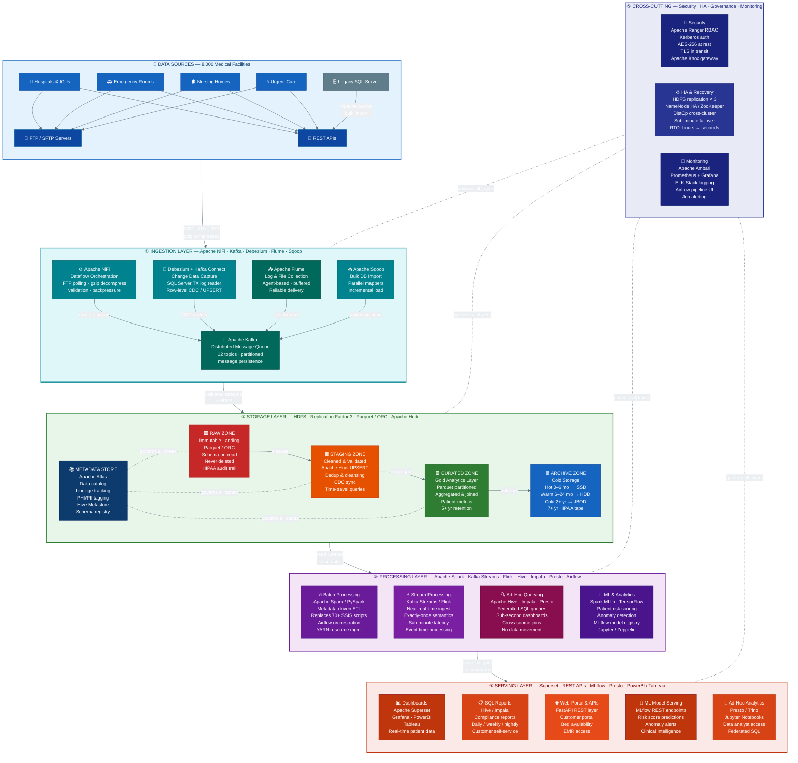

# 🏥 Enterprise Data Lake — Medical Data Processing Company

> **A comprehensive open-source Data Lake design and architecture proposal for a San Francisco-based EMR analytics company serving 8,000+ medical facilities across the United States.**

---

## 📋 Table of Contents

- [Project Overview](#-project-overview)
- [The Problem](#-the-problem)
- [Solution Summary](#-solution-summary)
- [Architecture](#-architecture)
  - [Architecture Diagram (Mermaid)](#architecture-diagram)
  - [Layer Breakdown](#layer-breakdown)
- [Technology Stack](#-technology-stack)
- [Design Principles](#-design-principles)
- [Data Flow](#-data-flow)
- [Storage Strategy](#-storage-strategy)
- [Security & Compliance](#-security--compliance)
- [Scalability](#-scalability)
- [Alternative Tools Evaluated](#-alternative-tools-evaluated)
- [Industry References](#-industry-references)
- [Assumptions & Risks](#-assumptions--risks)
- [Project Deliverables](#-project-deliverables)
- [References](#-references)

---

## 🔭 Project Overview

**Medical Data Processing Company** (founded 2007, San Francisco, CA) specializes in processing Electronic Medical Records (EMR) and delivering real-time analytics to medical facilities. Their platform serves:

| Metric | Value |
|--------|-------|
| 🏥 Medical Facilities | 8,000+ |
| 👥 Customers | ~1,100 |
| 👨‍💼 Employees | ~370 |
| 📦 Data Volume | 8 TB (SQL Server) |
| 📁 Files per Day | 15,000,000 |
| 🗜️ Zip Files per Day | 77,000 |
| 📈 YoY Growth Rate | 15–20% |

Customers include **urgent care clinics, hospitals, nursing homes, emergency rooms, and critical care units** who use the platform to stay HIPAA-compliant, track patient health metrics, manage bed availability, and monitor admit/discharge records.

---

## ⚠️ The Problem

The company's legacy infrastructure — a **monolithic 3-tier architecture backed by Microsoft SQL Server** — cannot scale with its rapid data growth.

### Critical Failures

```
Last week: Nightly ETL data surge → SQL Server crash → entire system offline for hours
           8,000 medical facilities lost access to patient data and compliance dashboards
```

### Root Causes

| Issue | Impact |
|-------|--------|
| 🔴 **Single-node SQL Server** | Single point of failure — one crash = total outage |
| 🔴 **Nightly-only batch ETL** | No real-time processing; stale data for 24 hours |
| 🔴 **70+ custom SSIS scripts** | Brittle, unmaintainable, one script per data source type |
| 🔴 **12 TB disk at 70% capacity** | Will be exhausted within 12–18 months at current growth |
| 🔴 **Nightly data exports for analytics** | Data duplication, version sprawl, silo proliferation |
| 🔴 **No rapid backup/recovery** | Hours-to-days RTO on SQL Server restore |
| 🔴 **No ML capability** | Cannot run models without extracting and moving data |

### Existing Infrastructure Limits

```
Master SQL Server:   64-core vCPU  |  512 GB RAM  |  12 TB disk (70% full)
Stage SQL Server:    Separate instance for ETL staging
Ingestion Servers:   3 servers (FTP, API agents, data extract)
Web/App Servers:     32 GB RAM, 16-core vCPU each
ETL Jobs:            70+ SSIS packages → 100+ tables
```

---

## ✅ Solution Summary

Migrate to a **fully open-source, on-premise Data Lake** built on the Apache Hadoop ecosystem — eliminating vendor lock-in, enabling horizontal scaling, supporting real-time processing, and providing a single governed source of truth for all 8,000 facilities.

### Key Outcomes

- ♾️ **Unlimited storage** on commodity hardware — scales to petabytes
- ⚡ **Near-real-time ingestion** replacing nightly-only batch ETL
- 🛡️ **Zero-downtime fault tolerance** via HDFS replication factor 3
- 🤖 **ML/AI ready** — TensorFlow and Spark MLlib run natively on the lake
- 🔐 **HIPAA compliant** — AES-256 encryption, Kerberos auth, Apache Ranger RBAC
- 📉 **40–60% storage cost reduction** via hot/warm/cold tiering
- 🔁 **1 metadata-driven PySpark framework** replaces 70+ SSIS scripts

---

## 🏛️ Architecture

### Architecture Diagram



### Layer Breakdown

| # | Layer | Role | Primary Tools |
|---|-------|------|---------------|
| ① | **Ingestion** | Collect & route all incoming data | NiFi, Kafka, Debezium, Sqoop, Flume |
| ② | **Storage** | Centralized immutable data lake | HDFS, Parquet, Apache Hudi, Atlas |
| ③ | **Processing** | Transform, query, and model data | Spark, Flink, Hive, Impala, Presto, Airflow |
| ④ | **Serving** | Deliver insights to end consumers | Superset, MLflow, REST APIs, PowerBI |
| ⑤ | **Cross-cutting** | Security, HA, governance, monitoring | Ranger, Kerberos, ZooKeeper, Prometheus |

---

## 🛠️ Technology Stack

### Ingestion Layer

| Tool | Purpose | Why Selected |
|------|---------|--------------|
| **Apache NiFi** | Dataflow orchestration | Visual UI, backpressure control, FTP/SFTP processors, metadata-driven flows |
| **Apache Kafka** | Distributed message queue | 10M+ msg/sec throughput, partition replication, message persistence & replay |
| **Debezium** | Change Data Capture (CDC) | SQL Server TX log reader — row-level CDC without application changes |
| **Apache Sqoop** | Bulk DB import | Parallel import jobs for initial SQL Server → HDFS migration |
| **Apache Flume** | Log & file collection | Stateless agents deployed at facility endpoints with channel buffering |

### Storage Layer

| Tool | Purpose | Why Selected |
|------|---------|--------------|
| **HDFS** | Distributed file system | Petabyte-scale, RF=3 fault tolerance, horizontal scale-out |
| **Apache Parquet** | Columnar file format | 60–80% compression vs CSV/XML; columnar pushdown for fast queries |
| **Apache Hudi** | UPSERT & CDC tables | Hadoop-native UPSERT, time-travel queries, incremental processing |
| **Apache Atlas** | Metadata & data catalog | Lineage tracking, PHI/PII classification, business glossary, Ranger integration |
| **Apache Ranger** | Security policy engine | Row/column-level RBAC, HIPAA-aligned access controls |

### Processing Layer

| Tool | Purpose | Why Selected |
|------|---------|--------------|
| **Apache Spark** | Unified batch + stream engine | In-memory 10–100× faster than MapReduce; PySpark ML ecosystem |
| **Kafka Streams** | Lightweight stream processing | Embedded in Kafka; stateful; no separate cluster needed |
| **Apache Flink** | Complex event processing | Exactly-once semantics, true event-time streaming, high throughput |
| **Apache Hive** | Batch SQL on HDFS | Full HDFS compatibility, large scan workloads, ACID support with ORC |
| **Apache Impala** | Low-latency interactive SQL | Sub-second dashboard queries on the Curated Zone |
| **Presto / Trino** | Federated ad-hoc SQL | Cross-source queries (HDFS + RDBMS + object stores) without data movement |
| **Apache Airflow** | Workflow orchestration | Python DAGs, dependency management, retry logic, web UI monitoring |
| **Spark MLlib** | Distributed ML | Native on HDFS — no data movement needed for model training |
| **TensorFlow on YARN** | Deep learning | GPU-capable; integrates with existing Hadoop cluster resource management |
| **MLflow** | ML lifecycle management | Experiment tracking, model versioning, REST serving endpoints |

### Serving Layer

| Tool | Purpose | Why Selected |
|------|---------|--------------|
| **Apache Superset** | Open-source BI dashboards | SQL-first, 40+ chart types, connects via ODBC to Impala/Presto |
| **Grafana** | Ops & metrics dashboards | Real-time time-series panels for infrastructure and pipeline monitoring |
| **FastAPI** | REST API layer | High-performance Python API serving customer portal requests |
| **MLflow REST** | Model serving | Standardized endpoint for risk scores and predictive analytics |
| **PowerBI / Tableau** | Enterprise BI (optional) | ODBC/JDBC connectivity to Impala or Presto for enterprise customers |

---

## 📐 Design Principles

### 1. 🔓 Open Source First — No Vendor Lock-in
All components are selected from the **Apache Software Foundation** open-source ecosystem. No GCP, AWS, Azure, Oracle, or proprietary licensing. This directly satisfies the business requirement to avoid vendor dependency and enables the company to run on any commodity hardware without licensing fees.

### 2. ⚖️ Separation of Storage and Compute
**HDFS** (storage) is fully decoupled from **Apache Spark + YARN** (compute). Storage nodes and compute nodes scale independently. When data volume grows, only storage nodes need to be added — compute nodes can remain unchanged, and vice versa.

### 3. 🎛️ Metadata-Driven Design
A **single parameterized PySpark framework** reads transformation rules from **Apache Atlas / Hive Metastore** and applies them dynamically. This replaces 70+ custom SSIS scripts with one maintainable codebase. New facility data sources onboard in **hours** instead of weeks.

### 4. 🔁 Fault Tolerance & High Availability
- HDFS **Replication Factor 3** → no data loss on node failure
- **ZooKeeper** → automatic NameNode leader election and failover
- **Kafka partition replication** → no message loss on broker failure
- **YARN** → automatic job rescheduling on executor failure
- RTO improvement: **hours → sub-minute**

### 5. 📖 Schema-on-Read & Data Immutability
The **Raw Zone is write-once, never deleted** — preserving a permanent audit trail required for HIPAA compliance. Structure is enforced at the Staging and Curated zones. Apache Hudi enables **time-travel queries** to audit historical states of any dataset.

---

## 🔄 Data Flow

```
8,000 Facilities
  │
  ├── FTP/SFTP push → Apache NiFi (decompress · validate · route)
  ├── REST API pull → Apache NiFi (poll · transform · route)
  ├── SQL Server     → Apache Sqoop (bulk import, initial migration)
  └── SQL Server CDC → Debezium + Kafka Connect (real-time row changes)
          │
          ▼
    Apache Kafka (topics per format/facility type)
          │
          ▼
   ┌──────────────────────────────────┐
   │        HDFS Storage              │
   │  RAW → STAGING → CURATED → ARCHIVE
   │        (Apache Hudi UPSERT)      │
   └──────────────────────────────────┘
          │
     ┌────┴────┐
     ▼         ▼
  Batch      Stream
  (Spark)   (Kafka Streams / Flink)
     │         │
     └────┬────┘
          ▼
   SQL Engines (Hive · Impala · Presto)
   ML Engines  (Spark MLlib · TensorFlow)
          │
          ▼
   Serving Layer (Superset · APIs · MLflow · Reports)
          │
          ▼
   End Users (Analysts · Customers · Engineers)
```

---

## 🗄️ Storage Strategy

### Medallion Architecture (4 Zones)

```
RAW ZONE          STAGING ZONE       CURATED ZONE      ARCHIVE ZONE
─────────────     ────────────────   ──────────────    ─────────────
Immutable         Cleaned &          Gold /            Cold storage
landing area      Validated          Analytics-ready   HIPAA 7yr+

Format:           Apache Hudi        Parquet           SSD→HDD→JBOD
Parquet / ORC     UPSERT support     Partitioned       Auto-tiered

Never deleted     Dedup & cleanse    Aggregated        Hot: 0–6 mo
HIPAA audit       Schema enforced    Joined            Warm: 6–24 mo
Schema-on-read    Time-travel        Business KPIs     Cold: 2+ yr
                  CDC sync                             Archive: 7+ yr
```

### Hot / Warm / Cold / Archive Tiering

| Tier | Age | Hardware | Latency | Cost |
|------|-----|----------|---------|------|
| 🔥 **Hot** | 0–6 months | SSD-backed HDFS nodes | Seconds | High |
| 🌤️ **Warm** | 6–24 months | HDD HDFS nodes | Minutes | Medium |
| ❄️ **Cold** | 2+ years | JBOD high-density HDD | Hours | Low |
| 📦 **Archive** | 7+ years (HIPAA) | Tape / Remote HDFS cluster | Days | Very Low |

> HDFS Storage Policies (`HOT`, `WARM`, `COLD`, `ALL_SSD`) auto-migrate data based on age and last-access time. Expected **40–60% cost reduction** vs uniform SSD storage.

### YoY Growth Projections

| Year | Data Size | Raw (RF=3) | HDFS Nodes Needed |
|------|-----------|------------|-------------------|
| 0 (current) | 8 TB | 24 TB | 2 nodes |
| 1 (+20%) | 9.6 TB | 28.8 TB | 3 nodes |
| 2 (+20%) | 11.5 TB | 34.5 TB | 3 nodes |
| 3 (+20%) | 13.8 TB | 41.4 TB | 4 nodes |
| 5 (+20%) | 20 TB | 60 TB | 5 nodes |

> **Parquet compression (60–80%)** reduces the effective node requirement — 8 TB of raw CSV/XML occupies ~1.6–3.2 TB in Parquet, extending capacity runway by 2–3 years.

---

## 🔐 Security & Compliance

| Control | Tool | Coverage |
|---------|------|----------|
| **Authentication** | Kerberos | All services and users on the cluster |
| **Authorization** | Apache Ranger RBAC | Row-level and column-level access policies |
| **Encryption at Rest** | HDFS TDE (AES-256) | All zones containing PHI/PII data |
| **Encryption in Transit** | TLS / SSL | All data movement between NiFi, Kafka, HDFS, Spark |
| **Perimeter Gateway** | Apache Knox | External API access to the Hadoop cluster |
| **Data Classification** | Apache Atlas | PHI/PII tagging on every column and dataset |
| **Audit Trail** | Raw Zone immutability | Write-once data preserved for HIPAA 6-year minimum |
| **Access Governance** | Apache Ranger policies | Minimum-necessary access per HIPAA requirement |

---

## 📈 Scalability

### Ingestion Layer Scaling

| Component | Baseline | Year 2 | Year 3 | Scaling Mechanism |
|-----------|----------|--------|--------|-------------------|
| NiFi | 3 nodes | 4 nodes | 6 nodes | Add nodes to cluster; auto-rebalance |
| Kafka | 12 partitions | 18 partitions | 24 partitions | Expand partitions online; auto-rebalance consumers |
| Sqoop | 8 mappers | 16 mappers | 32 mappers | Increase `-m` parameter; no infra change |
| Flume | Per-endpoint agents | Per-endpoint agents | Per-endpoint agents | Deploy new agent per new facility |

### Processing Layer Scaling

- **YARN Dynamic Allocation** — Spark executors scale from 10 → 100+ based on queue depth
- **Kafka Streams** — partition expansion from 12 → 48 triggers automatic consumer rebalancing
- **Apache Flink** — add TaskManager nodes for linear stream throughput scaling
- **Impala / Presto** — add query worker nodes to increase concurrent dashboard capacity
- **Airflow** — migrate from `LocalExecutor` → `CeleryExecutor` for distributed DAG execution

---

## 🔀 Alternative Tools Evaluated

| Layer | Selected | Alternative 1 | Alternative 2 | Key Reason for Selection |
|-------|----------|---------------|---------------|--------------------------|
| Ingestion | Apache NiFi | Logstash (ELK) | StreamSets | NiFi: visual UI + backpressure; Logstash is log-centric only |
| Streaming | Apache Kafka | Apache Pulsar | RabbitMQ | Kafka: proven at scale; Pulsar lacks ecosystem maturity |
| Storage | HDFS + Parquet | MinIO (S3) | Apache Iceberg | HDFS: deep Hadoop integration; MinIO has limited CDC support |
| UPSERT/CDC | Apache Hudi | Delta Lake | Apache Iceberg | Hudi: Hadoop-native; Delta requires Databricks runtime |
| Batch | Apache Spark | Hadoop MapReduce | Dask | Spark: 10–100× faster in-memory vs disk-based MapReduce |
| Stream | Kafka Streams | Apache Flink | Apache Storm | Flink: true streaming + exactly-once; Storm is low-level |
| Ad-hoc SQL | Presto/Trino | Apache Impala | Apache Hive | Presto: federated cross-source SQL; Hive is slow interactive |
| Metadata | Apache Atlas | Apache Amundsen | DataHub | Atlas: tightest Ranger/HDFS integration |
| Orchestration | Apache Airflow | Apache Oozie | Prefect | Airflow: Python DAGs + rich UI; Oozie uses XML config |
| Security | Apache Ranger | Apache Sentry | OpenLDAP | Ranger: fine-grained row/column RBAC with governance UI |
| BI | Apache Superset | Grafana | Redash | Superset: full BI suite; Grafana is metrics/time-series only |

---

## 🌍 Industry References

| Company | Industry | Stack | Key Achievement |
|---------|----------|-------|-----------------|
| **Netflix** | Media & Tech | Spark, Iceberg, Hive, Presto | Petabyte-scale lake for 230M+ subscribers; eliminated data silos across 100+ microservices |
| **Uber** | Ride-sharing | Kafka, Hadoop, Spark, Hudi | Invented Apache Hudi; processes 1 TB+/hour; powers real-time driver-rider matching |
| **LinkedIn** | Professional Network | Kafka, Hadoop, Samza, DataHub | Invented Apache Kafka; DataHub governs trillions of events/day for 100M+ members |
| **NYU Langone Health** | Healthcare | Hadoop, Spark, Kafka | HIPAA-compliant EMR lake; real-time ICU dashboards demonstrably reduced patient mortality |
| **Mayo Clinic** | Healthcare Research | Hadoop, Spark, ML stack | Genomic research data lake; AI-assisted diagnostics processing billions of clinical data points |

---

## ⚠️ Assumptions & Risks

### Assumptions

| # | Assumption | Design Impact | Risk if Wrong |
|---|-----------|---------------|---------------|
| 1 | On-premise data center can host a 10+ node Hadoop cluster | Architecture designed for on-prem HDFS — no cloud components | Would require cloud migration planning, changing architecture significantly |
| 2 | Internal network ≥ 1 Gbps to support 700K files/hour via Kafka | Kafka streaming ingestion assumes network capacity | Insufficient bandwidth → buffered batch ingestion, losing real-time capability |
| 3 | HDFS RF=3 provides adequate durability without geo-redundancy | Single DC cluster with local replication | If geo-redundancy required → add DistCp cross-cluster replication |
| 4 | Existing SSIS ETL logic is documented and can be parameterized | Metadata-driven PySpark framework assumes transformations are extractable | Undocumented SSIS packages → significant reverse-engineering effort |
| 5 | Source data is pseudonymized/de-identified per HIPAA Safe Harbor | Security design handles RBAC/encryption, not PHI de-identification | Raw PHI ingested → additional HIPAA-compliant de-identification pipeline required |
| 6 | Company can hire/retain engineers proficient in PySpark, Hadoop, Kafka | Architecture assumes in-house operational capability | Talent gaps → external consulting needed during implementation phase |

### Risks

| Risk | Severity | Mitigation |
|------|----------|------------|
| **Migration cutover** — moving 8 TB live without downtime | 🔴 High | Parallel-run strategy: run both systems simultaneously during transition |
| **Operational complexity** — Hadoop ecosystem requires specialist expertise | 🟡 Medium | Use Cloudera Manager or Apache Ambari; invest in team training |
| **Data quality propagation** — bad data in Raw Zone reaches Curated Zone | 🟡 Medium | NiFi validation rules + Great Expectations data quality framework |
| **HIPAA misconfiguration** — Ranger policy gaps exposing PHI | 🔴 High | Regular security audits, penetration testing, and Ranger policy reviews |
| **NameNode complexity** — ZooKeeper failover still requires operational care | 🟡 Medium | Regular chaos engineering exercises; test failover quarterly |

---

## 📦 Project Deliverables

| # | Deliverable | Description | File |
|---|------------|-------------|------|
| 1 | **Architecture Diagram** | End-to-end SVG/PNG diagram — all 4 layers, metadata location, tool names, data flows | `architecture_diagram_v2.svg` |
| 2 | **Design Document** | 21-page technical proposal: requirements, principles, assumptions, all 4 layers with scaling plans, alternatives, security, hot/cold strategy | `design_document_v2.docx` |
| 3 | **Executive Presentation** | 10-slide deck for CTO and leadership — data lake definition, components, DW vs DL comparison, business value, architecture, industry references | `datalake_presentation_v2.pptx` |

### Rubric Compliance Summary

| Criterion | Status |
|-----------|--------|
| Architecture diagram with all 4 layers + metadata location + tool names | ✅ Met |
| Design doc: purpose, audience, 3+ in-scope, 3+ out-of-scope | ✅ Met |
| Design doc: problem summary + 3 design principles with justification | ✅ Met |
| Design doc: 3+ assumptions with impact + risks described | ✅ Met (6 assumptions, 5 risks) |
| Design doc: ingestion layer — tools, justification, scaling, 3+ alternatives | ✅ Met |
| Design doc: storage layer — YoY growth, backup/recovery, metadata fields, format, security, alternatives | ✅ Met |
| Design doc: processing layer — batch/stream/CDC/ad-hoc, scaling, 3+ alternatives | ✅ Met |
| Design doc: serving layer — definition, data types, how used | ✅ Met |
| Design doc: conclusion with next steps + references | ✅ Met (15 references) |
| Slide show: data lake definition + "used for" | ✅ Met |
| Slide show: 4+ components with descriptions | ✅ Met (5 components) |
| Slide show: 4+ DW vs DL differentiators | ✅ Met (8 differentiators) |
| Slide show: 4+ business values tied to company requirements | ✅ Met (6 values) |
| Slide show: same architecture diagram as deliverable #1 | ✅ Met |
| **Standout**: alternative tools per layer with pros/cons | ✅ Met (11 layers) |
| **Standout**: hot/cold data archival strategy | ✅ Met (4-tier table) |
| **Standout**: real-world Data Lake references | ✅ Met (5 companies) |

---

## 🔗 References

| Resource | URL |
|----------|-----|
| Apache Hadoop | https://hadoop.apache.org |
| Apache Kafka | https://kafka.apache.org/documentation |
| Apache NiFi | https://nifi.apache.org/docs.html |
| Apache Spark | https://spark.apache.org/docs/latest |
| Apache Hudi | https://hudi.apache.org |
| Apache Atlas | https://atlas.apache.org |
| Apache Ranger | https://ranger.apache.org |
| Debezium CDC | https://debezium.io/documentation |
| Presto / Trino | https://trino.io/docs/current |
| Apache Airflow | https://airflow.apache.org/docs |
| Apache Superset | https://superset.apache.org |
| MLflow | https://mlflow.org/docs/latest |
| Netflix Tech Blog | https://netflixtechblog.com |
| Uber Engineering — Apache Hudi | https://eng.uber.com/apache-hudi |
| HIPAA Data Retention | https://www.hhs.gov/hipaa |

---

## 📄 License

This project and its documentation are submitted as academic coursework for the **Udacity Data Engineering Nanodegree — Integrated Project Submission (IPS) Version 1.0**.

All architecture designs, written content, and code are **original work**. No content has been copied or plagiarized from external sources. Referenced tools and technologies remain the intellectual property of their respective open-source projects and foundations.

---

<div align="center">

**Medical Data Processing Company — Enterprise Data Lake Project**  
*Udacity IPS Version 1.0 · Data Engineering Nanodegree*  
*San Francisco, CA · 2024*

</div>
