# 🎬 SentimentScope

<div align="center">


**A Transformer-based binary sentiment classifier built from scratch on the IMDB Large Movie Review Dataset.**

*Udacity AI Programming with Python Nanodegree — Capstone Project*

[Overview](#-overview) · [Results](#-results) · [Architecture](#-architecture) · [Getting Started](#-getting-started) · [Usage](#-usage) · [Project Structure](#-project-structure) · [References](#-references)

</div>

---

## 📋 Overview

SentimentScope is an end-to-end natural language processing pipeline that trains a custom Transformer encoder — built entirely from first principles using PyTorch — to classify movie reviews as **positive** or **negative**. The system uses the `bert-base-uncased` tokenizer from Hugging Face for robust subword tokenization, and delivers a production-ready inference API through the `SentimentAnalyzer` class.

The project covers the complete machine learning lifecycle:

- Exploratory data analysis and dataset preparation
- Custom `Dataset` and `DataLoader` construction
- Transformer architecture design with multi-head self-attention
- Epoch-based training with cross-entropy loss and validation monitoring
- Checkpoint persistence and model restoration
- A clean inference API returning labels, confidence scores, and raw probabilities

> **Project Goal:** Achieve > 75% test accuracy on the IMDB dataset using a Transformer trained from scratch.  
> **Achieved:** **76.74%** test accuracy in 3 epochs ✅

---

## 📊 Results

### Baseline Training (3 Epochs)

| Epoch | Validation Accuracy | Final Loss |
|-------|-------------------|------------|
| 1     | 70.00%            | 0.5467     |
| 2     | 74.08%            | 0.4763     |
| 3     | 77.12%            | 0.4237     |

**Test Accuracy: 76.74%** — exceeding the 75% benchmark.

### Standout Extension (25 Epochs, Cosine LR Annealing)

An extended training run targeting > 90% accuracy was conducted with a cosine annealing learning rate schedule. The model peaked at **77.16%** validation accuracy (epoch 6) and achieved a standout test accuracy of **74.46%**, revealing a performance ceiling inherent to the from-scratch approach at this scale.

> **Key Insight:** More training epochs alone cannot overcome architectural capacity limits. Reaching > 80% accuracy on IMDB from scratch requires a larger model or transfer learning from a pre-trained backbone (e.g., full BERT, RoBERTa).

### Inference Demo

```
[1] Review    : This movie was absolutely fantastic! One of the best I've ever seen.
    Label     : Positive 👍  |  Confidence: 99.2%

[2] Review    : Terrible plot, wooden acting, and a complete waste of two hours.
    Label     : Negative 👎  |  Confidence: 100.0%

[3] Review    : It was okay — nothing special, but not completely awful either.
    Label     : Negative 👎  |  Confidence: 86.8%

[4] Review    : A masterpiece of storytelling. The performances were breathtaking.
    Label     : Positive 👍  |  Confidence: 97.8%

[5] Review    : I fell asleep halfway through. Painfully boring from start to finish.
    Label     : Negative 👎  |  Confidence: 98.8%
```

---

## 🏗 Architecture

### Model Configuration

| Hyperparameter      | Value              |
|---------------------|--------------------|
| Vocabulary Size     | 30,522             |
| Embedding Dimension | 128                |
| Context Window      | 128 tokens         |
| Transformer Blocks  | 4                  |
| Attention Heads     | 4                  |
| Head Size           | 32                 |
| Dropout Rate        | 0.1                |
| Output Classes      | 2 (Pos / Neg)      |
| Optimizer           | Adam (lr = 1e-3)   |
| Loss Function       | Cross-Entropy      |

### Transformer Block

Each block follows the standard encoder pattern:

```
Token Embeddings + Positional Embeddings
        ↓
Multi-Head Self-Attention (4 heads × 32 dim)
        ↓
Residual Connection + Layer Normalization
        ↓
Position-wise Feed-Forward Network (ReLU + Dropout)
        ↓
Residual Connection + Layer Normalization
```

After 4 stacked blocks, **mean pooling** across the sequence dimension produces a single 128-dim vector per review, which is passed to a linear classification head.

---

### Data Science Flow

```mermaid
flowchart TD
    A([🗂️ Raw IMDB Dataset\n50,000 Movie Reviews]) --> B[Load Dataset\nload_dataset&#40;&#41;]
    B --> C[Convert to Pandas DataFrame\nReview + Label columns]
    C --> D[EDA & Visualisation\nLength distributions, class balance]
    D --> E{Train / Test Split}
    E -->|25,000 reviews| F[Training Partition]
    E -->|25,000 reviews| G[Test Partition]
    F --> H{Train / Val Split}
    H -->|22,500 samples| I[Train Set]
    H -->|2,500 samples| J[Validation Set]

    I --> K[bert-base-uncased Tokenizer\nSubword tokenisation\nPad / Truncate → 128 tokens]
    J --> K
    G --> K

    K --> L[IMDBDataset\nPyTorch Custom Dataset]
    L --> M[DataLoader\nBatch=32, Shuffle=True for Train]

    M --> N[🧠 Transformer Encoder\n4 Blocks · 4 Heads · d=128]
    N --> O[Token Embeddings\n+ Positional Embeddings]
    O --> P[Multi-Head Self-Attention]
    P --> Q[Residual + LayerNorm]
    Q --> R[Feed-Forward Network]
    R --> S[Residual + LayerNorm]
    S -->|×4 blocks| P

    S --> T[Mean Pooling\nSequence → Single Vector]
    T --> U[Linear Classification Head\n128 → 2 logits]
    U --> V[Cross-Entropy Loss]
    V --> W[Adam Optimizer\nBackpropagation]
    W -->|Update weights| N

    J --> X[evaluate_accuracy&#40;&#41;\nValidation Loop]
    X --> Y{Val Accuracy\nImproving?}
    Y -->|Yes| Z[💾 Save Checkpoint\nWeights + Config]
    Y -->|No| AA[Continue Training]
    AA --> N

    Z --> AB[SentimentAnalyzer\nInference Class]
    G --> AC[Final Test Evaluation\nTest Accuracy: 76.74%]
    AB --> AD([🚀 Deployed Inference API\npredict&#40;&#41; · predict_single&#40;&#41;])

    %% ── Data source & output endpoints ──
    style A  fill:#6A0DAD,color:#fff,stroke:#4B0082,stroke-width:2px
    style AD fill:#6A0DAD,color:#fff,stroke:#4B0082,stroke-width:2px

    %% ── Data loading & EDA ──
    style B  fill:#1565C0,color:#fff,stroke:#0D47A1,stroke-width:1.5px
    style C  fill:#1565C0,color:#fff,stroke:#0D47A1,stroke-width:1.5px
    style D  fill:#1565C0,color:#fff,stroke:#0D47A1,stroke-width:1.5px

    %% ── Split decision diamonds ──
    style E  fill:#E65100,color:#fff,stroke:#BF360C,stroke-width:2px
    style H  fill:#E65100,color:#fff,stroke:#BF360C,stroke-width:2px

    %% ── Data partitions ──
    style F  fill:#00695C,color:#fff,stroke:#004D40,stroke-width:1.5px
    style G  fill:#00695C,color:#fff,stroke:#004D40,stroke-width:1.5px
    style I  fill:#2E7D32,color:#fff,stroke:#1B5E20,stroke-width:1.5px
    style J  fill:#2E7D32,color:#fff,stroke:#1B5E20,stroke-width:1.5px

    %% ── Tokenization ──
    style K  fill:#F9A825,color:#000,stroke:#F57F17,stroke-width:1.5px

    %% ── PyTorch dataset & loader ──
    style L  fill:#EF6C00,color:#fff,stroke:#E65100,stroke-width:1.5px
    style M  fill:#EF6C00,color:#fff,stroke:#E65100,stroke-width:1.5px

    %% ── Transformer model (blue family) ──
    style N  fill:#0277BD,color:#fff,stroke:#01579B,stroke-width:2px
    style O  fill:#0288D1,color:#fff,stroke:#0277BD,stroke-width:1.5px
    style P  fill:#039BE5,color:#fff,stroke:#0288D1,stroke-width:1.5px
    style Q  fill:#29B6F6,color:#000,stroke:#039BE5,stroke-width:1.5px
    style R  fill:#4FC3F7,color:#000,stroke:#29B6F6,stroke-width:1.5px
    style S  fill:#29B6F6,color:#000,stroke:#039BE5,stroke-width:1.5px

    %% ── Pooling & classification head ──
    style T  fill:#7B1FA2,color:#fff,stroke:#6A1B9A,stroke-width:1.5px
    style U  fill:#8E24AA,color:#fff,stroke:#7B1FA2,stroke-width:1.5px

    %% ── Loss & optimiser ──
    style V  fill:#C62828,color:#fff,stroke:#B71C1C,stroke-width:2px
    style W  fill:#D32F2F,color:#fff,stroke:#C62828,stroke-width:1.5px

    %% ── Validation loop ──
    style X  fill:#00838F,color:#fff,stroke:#006064,stroke-width:1.5px
    style Y  fill:#00ACC1,color:#fff,stroke:#00838F,stroke-width:2px
    style AA fill:#00ACC1,color:#fff,stroke:#00838F,stroke-width:1.5px

    %% ── Checkpoint & results ──
    style Z  fill:#388E3C,color:#fff,stroke:#2E7D32,stroke-width:2px
    style AC fill:#388E3C,color:#fff,stroke:#2E7D32,stroke-width:2px
    style AB fill:#558B2F,color:#fff,stroke:#33691E,stroke-width:1.5px
```



---

## 🚀 Getting Started

### Prerequisites

- Python 3.8+
- CUDA-compatible GPU (recommended)
- `pip` or `conda`

### Installation

```bash
# 1. Clone the repository
git clone https://github.com/your-username/sentimentscope.git
cd sentimentscope

# 2. Create and activate a virtual environment
python -m venv venv
source venv/bin/activate        # Linux / macOS
# venv\Scripts\activate         # Windows

# 3. Install dependencies
pip install -r requirements.txt
```

### Requirements

```txt
torch>=2.0.0
transformers>=4.30.0
datasets
pandas
numpy
matplotlib
seaborn
tqdm
```

### Dataset Setup

Download the [Large Movie Review Dataset (aclIMDB)](https://ai.stanford.edu/~amaas/data/sentiment/) and place it in the project root:

```
sentimentscope/
└── aclIMDB/
    ├── train/
    │   ├── pos/
    │   └── neg/
    └── test/
        ├── pos/
        └── neg/
```

---

## 💻 Usage

### Training the Model

Open and run `SentimentScope_final.ipynb` end-to-end, or execute the training script directly:

```python
# Configure training
EPOCHS = 3
BATCH_SIZE = 32
D_EMBED = 128
N_BLOCKS = 4
N_HEADS = 4
DROPOUT = 0.1
LEARNING_RATE = 1e-3
SEQ_LEN = 128
CHECKPOINT_PATH = "demogpt_sentiment"
```

### Running Inference

```python
from sentiment_analyzer import SentimentAnalyzer

# Load from checkpoint (no retraining needed)
analyzer = SentimentAnalyzer(
    checkpoint_path="demogpt_sentiment",
    tokenizer=tokenizer
)

# Batch prediction
reviews = [
    "This movie was absolutely fantastic!",
    "Terrible plot, wooden acting, complete waste of time.",
    "An okay film — nothing special."
]

results = analyzer.predict(reviews)
for result in results:
    print(f"Label: {result['label']} | Confidence: {result['confidence']}")
    print(f"Raw probs: Neg={result['raw_probs']['negative']} | Pos={result['raw_probs']['positive']}")

# Single review convenience method
single = analyzer.predict_single("What a brilliant and moving film!")
print(f"Prediction: {single['label']} ({single['confidence']})")
```

### Output Format

```python
{
    "review":      str,    # Input text
    "label":       str,    # "Positive 👍" or "Negative 👎"
    "confidence":  str,    # e.g. "97.8%"
    "raw_probs": {
        "negative": str,   # e.g. "2.2%"
        "positive": str    # e.g. "97.8%"
    }
}
```

---

## 📁 Project Structure

```
sentimentscope/
│
├── SentimentScope_final.ipynb   # Main project notebook (training + inference)
├── README.md                    # This file
├── requirements.txt             # Python dependencies
│
├── aclIMDB/                     # Dataset directory (not tracked in git)
│   ├── train/
│   └── test/
│
├── checkpoints/                 # Saved model weights (generated at runtime)
│   └── demogpt_sentiment/
│       ├── model_weights.pt
│       └── config.json
│
└── outputs/                     # Training logs and evaluation artifacts
```

---

## 🔬 Methodology

### Data Preparation

The aclIMDB dataset was loaded using a custom `load_dataset()` function that reads all `.txt` files from the `pos/` and `neg/` subdirectories, assigning labels of `1` (positive) and `0` (negative) respectively. Reviews were converted to a Pandas DataFrame for exploratory analysis, revealing a broad distribution of review lengths from under 50 to over 1,000 words.

### Tokenization

All reviews were tokenized using `bert-base-uncased` from Hugging Face, providing a 30,522-token subword vocabulary. Sequences were padded or truncated to a fixed length of 128 tokens, balancing context coverage against memory efficiency.

### Training Strategy

- **Baseline:** 3 epochs, Adam optimizer (lr=1e-3), batch size 32, cross-entropy loss
- **Standout:** 25 epochs, cosine annealing LR schedule (max=1e-4), same architecture

Validation accuracy was evaluated after each epoch using `evaluate_accuracy()` with `torch.no_grad()` to disable gradient computation during evaluation.

### Checkpointing

Model weights and configuration are saved using PyTorch's `state_dict` mechanism. The `SentimentAnalyzer` class restores the model from disk, reporting checkpoint test accuracy on load.

---

## 📈 Performance Analysis

| Configuration              | Val Accuracy (Best) | Test Accuracy |
|----------------------------|--------------------:|--------------:|
| Baseline (3 epochs)        | 77.12%              | **76.74%**    |
| Standout (25 epochs + LR)  | 77.16%              | 74.46%        |

The standout run confirmed a performance plateau characteristic of small from-scratch Transformers on this dataset. Future improvements should explore:

- **Fine-tuning pre-trained models** (BERT, RoBERTa, DistilBERT)
- **Larger architecture** — increased `d_embed`, more blocks/heads
- **Data augmentation** — back-translation, synonym replacement
- **Label smoothing** to reduce overconfidence

---

## 🤝 Contributing

Contributions are welcome! Please follow these steps:

1. Fork the repository
2. Create a feature branch: `git checkout -b feature/your-feature-name`
3. Commit your changes: `git commit -m 'Add some feature'`
4. Push to the branch: `git push origin feature/your-feature-name`
5. Open a Pull Request

---

## 📚 References

1. Udacity. (n.d.). *AI Programming with Python Nanodegree*. Udacity, Inc. https://www.udacity.com/course/ai-programming-python-nanodegree--nd089

2. Maas, A. L., Daly, R. E., Pham, P. T., Huang, D., Ng, A. Y., & Potts, C. (2011). Learning word vectors for sentiment analysis. *Proceedings of the 49th Annual Meeting of the Association for Computational Linguistics (ACL 2011)*, 142–150.

3. Vaswani, A., Shazeer, N., Parmar, N., Uszkoreit, J., Jones, L., Gomez, A. N., Kaiser, Ł., & Polosukhin, I. (2017). Attention is all you need. *Advances in Neural Information Processing Systems*, 30.

4. Devlin, J., Chang, M.-W., Lee, K., & Toutanova, K. (2019). BERT: Pre-training of deep bidirectional transformers for language understanding. *Proceedings of NAACL-HLT 2019*, 4171–4186.

5. Hugging Face. (n.d.). *bert-base-uncased* [Pre-trained tokenizer and model]. https://huggingface.co/bert-base-uncased

6. PyTorch. (n.d.). *torch.mean* [Documentation]. https://pytorch.org/docs/stable/generated/torch.mean.html

---

## 📄 License

This project is licensed under the MIT License — see the [LICENSE](LICENSE) file for details.

---

<div align="center">

Made with ❤️ as part of the **Udacity AI Programming with Python Nanodegree**

⭐ Star this repo if you found it helpful!

</div>
