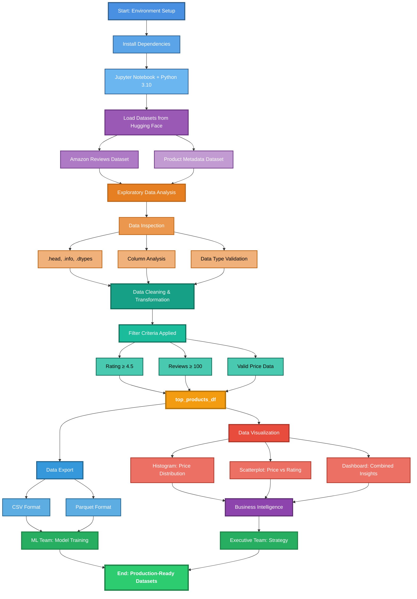

# Transformational AI: Analyzing Ecommerce Large Datasets for Machine Learning

[](https://www.python.org/downloads/)
[](https://jupyter.org/)
[](https://www.udacity.com)

## 📋 Project Overview

This project is part of the Udacity AI Programming with Python Nanodegree program, focusing on data transformation, analysis, and visualization using real-world Amazon Reviews datasets. As a data scientist at Transformational AI, this project demonstrates proficiency in working with large-scale ecommerce data to prepare datasets for machine learning applications.

The project leverages the Amazon Reviews 2023 dataset (Electronics category) from Hugging Face to perform comprehensive data analysis, cleaning, and visualization, ultimately preparing high-quality datasets for ML model training and customer satisfaction analysis.

## 🎯 Learning Objectives

- Work with large datasets using Python virtual environments and Jupyter Notebooks
- Master pandas DataFrames for data manipulation and transformation
- Perform exploratory data analysis (EDA) on real-world ecommerce data
- Create compelling data visualizations using matplotlib and seaborn
- Export cleaned data in multiple formats (CSV and Parquet) for ML pipelines
- Apply Python programming fundamentals in a professional data science context

## 🗂️ Project Structure

```
├── Udacity_-_PCEP_Project.ipynb    # Main Jupyter notebook
├── top_products.csv                # Cleaned dataset (CSV format)
├── top_products.parquet            # Cleaned dataset (Parquet format)
├── user_inputs.txt                 # Reflection question answers
└── README.md                       # Project documentation
```

## 🔧 Technologies & Dependencies

### Core Libraries
- **Python** 3.10.13
- **Jupyter Notebook** 6.5.6

### Data Analysis & Manipulation
- **pandas** 2.2.3 - Data structures and analysis
- **numpy** 2.1.2 - Numerical computing
- **datasets** 3.0.1 - Hugging Face datasets integration

### Data Visualization
- **matplotlib** 3.9.2 - Plotting and visualization
- **seaborn** 0.13.2 - Statistical data visualization

### Data Storage
- **pyarrow** 17.0.0 - Efficient columnar data formats (Parquet)

## 📦 Installation

### Prerequisites
Ensure you have Python 3.10+ installed on your system.

### Setup Instructions

1. **Clone or download the project files**

2. **Create a virtual environment** (recommended)
```bash
python -m venv venv
source venv/bin/activate  # On Windows: venv\Scripts\activate
```

3. **Install required packages**
```bash
pip install datasets pandas matplotlib seaborn pyarrow
```

4. **Launch Jupyter Notebook**
```bash
jupyter notebook
```

5. **Open the project notebook**
Navigate to `Udacity_-_PCEP_Project.ipynb` in the Jupyter interface.

## 📊 Data Sources

This project utilizes two primary datasets from the Amazon Reviews 2023 collection:

1. **Amazon Reviews Dataset** - Customer reviews with ratings, text, and metadata
   - Source: [McAuley-Lab/Amazon-Reviews-2023](https://huggingface.co/datasets/McAuley-Lab/Amazon-Reviews-2023)
   - Category: Electronics
   - Features: rating, title, text, images, ASIN, user_id, timestamp, helpful_vote, verified_purchase

2. **Amazon Reviews Metadata Dataset** - Product information and statistics
   - Source: [McAuley-Lab/Amazon-Reviews-2023](https://huggingface.co/datasets/McAuley-Lab/Amazon-Reviews-2023)
   - Category: Electronics
   - Features: main_category, title, average_rating, rating_number, price, features, description, store, categories

## 🏗️ Architecture

### Data Science Workflow



### Pipeline Overview

The data science pipeline follows a systematic approach:

1. **Ingestion Layer** - Data acquisition from Hugging Face datasets
2. **Processing Layer** - Pandas-based data transformation and cleaning
3. **Analysis Layer** - Statistical analysis and quality assessment
4. **Visualization Layer** - matplotlib/seaborn for insights generation
5. **Export Layer** - Multi-format output for downstream consumers

## 🚀 Project Workflow

### Part 1: Environment Setup
- Configure Jupyter Notebook environment
- Verify Python and package versions
- Install and validate required libraries

### Part 2: Reviews Dataset Analysis
- Download and load Amazon reviews data using Hugging Face datasets
- Explore data structure with pandas DataFrames
- Analyze data types, columns, and review patterns
- Transform DataFrames for improved readability

### Part 3: Metadata Dataset Analysis
- Load product metadata for electronics category
- Compare reviews and metadata datasets
- Implement error handling for large dataset operations
- Safeguard data access with proper exception handling

### Part 4: Dataset Comparison
- Compare columns across both datasets
- Analyze data types and structures using `.dtypes`
- Generate comprehensive summaries with `.info()`
- Identify relationships between reviews and product metadata

### Part 5: Data Preparation for Machine Learning
- Filter and clean data based on ML team requirements
- Create `top_products_df` with high-quality products (rating ≥ 4.5, reviews ≥ 100)
- Calculate data cleaning percentages and statistics
- Export datasets in CSV and Parquet formats
- Extract and transform product titles into readable formats

### Part 6: Data Visualization
- Create histogram visualizations for price distribution
- Generate scatterplots for price vs. rating analysis
- Build combined distribution plots for comprehensive insights
- Develop dashboards with filtered views for stakeholder presentations
- Identify trends in highly-rated products and pricing patterns

## 📈 Key Features & Analyses

### Data Cleaning Criteria
The project filters products based on these parameters:
- **Minimum Rating**: 4.5 stars or higher
- **Minimum Reviews**: 100+ customer reviews
- **Price Availability**: Products with valid price data
- **Data Completeness**: Complete records without null values

### Visualization Outputs
1. **Price Distribution Histogram** - Frequency analysis of highly-rated product prices
2. **Price vs. Rating Scatterplot** - Relationship between pricing and customer satisfaction
3. **Combined Distribution Dashboard** - Multi-faceted view of product performance
4. **Filtered Analytics** - Focused insights on premium product segments

## 💡 Insights & Findings

The project addresses several business-critical questions:

1. **Data Structure Understanding** - Reviews contain 10 columns with mixed data types (numerical, text, boolean)
2. **Dataset Differences** - Reviews focus on customer feedback; metadata emphasizes product specifications
3. **Data Quality** - Cleaning reduces dataset size significantly while maintaining high-quality samples
4. **Price-Rating Trends** - Analysis reveals correlations between product pricing and customer satisfaction
5. **Top Product Identification** - Enables ML teams to focus on high-performing product categories

## 📝 Reflection Questions

The project includes 7 comprehensive reflection questions covering:
- Data structure and organization
- Pandas methods and outputs
- DataFrame transformations
- Dataset comparisons
- Most insightful analysis methods
- Price and frequency trends
- Price and rating relationships

Answers are documented in `user_inputs.txt`.

## 🎓 PCEP Exam Alignment

This project reinforces key concepts for the Python Certified Entry-Level Programmer (PCEP) certification:

- Python syntax and semantics
- Data types and structures (lists, dictionaries, DataFrames)
- Control flow (loops, conditionals, exception handling)
- Functions and modules
- File operations (reading/writing CSV and Parquet)
- Working with libraries and packages

## 📚 References

### Educational Program
[1] Udacity. (2024). AI Programming with Python Nanodegree Program. [Course Link](https://www.udacity.com/course/ai-programming-python-nanodegree--nd089)

### Data Sources
[2] Hou, Y., Li, J., He, Z., Yan, A., Chen, X., & McAuley, J. (2024). Bridging Language and Items for Retrieval and Recommendation. Amazon Reviews 2023 Dataset. [Hugging Face](https://huggingface.co/datasets/McAuley-Lab/Amazon-Reviews-2023)

### Python Libraries
[3] McKinney, W. (2010). Data Structures for Statistical Computing in Python. [pandas](https://pandas.pydata.org/)

[4] Harris, C. R., et al. (2020). Array programming with NumPy. Nature, 585(7825), 357-362. [NumPy](https://numpy.org/)

[5] Hunter, J. D. (2007). Matplotlib: A 2D Graphics Environment. [Matplotlib](https://matplotlib.org/)

[6] Waskom, M. L. (2021). seaborn: statistical data visualization. [Seaborn](https://seaborn.pydata.org/)

### Documentation
[7] pandas Development Team. (2024). [pandas Documentation](https://pandas.pydata.org/docs/)

[8] scikit-learn Developers. (2024). [User Guide: Clustering](https://scikit-learn.org/stable/modules/clustering.html)

[9] Hugging Face. (2024). [Datasets Library Documentation](https://huggingface.co/docs/datasets/)

## 🏆 Project Outcomes

Upon completion, this project delivers:

- ✅ Fully analyzed Amazon Electronics reviews dataset
- ✅ Cleaned and filtered top products dataset (CSV and Parquet formats)
- ✅ Comprehensive data visualizations for business insights
- ✅ Production-ready datasets for ML model training
- ✅ Professional data analysis documentation
- ✅ PCEP exam preparation through practical application

## 🎯 Use Cases

This project's outputs support multiple organizational needs:

1. **Machine Learning Team** - Clean datasets for model training and fine-tuning
2. **Business Analytics Team** - Insights into product performance and pricing strategies
3. **Executive Team** - High-level dashboards for strategic decision-making
4. **Product Team** - Customer sentiment analysis and product improvement opportunities

## 📥 Deliverables

The following files should be present in your project directory:

- ✅ Jupyter Notebook with cell outputs included
- ✅ `user_inputs.txt` with reflection question answers
- ✅ `top_products.csv` dataset (CSV format)
- ✅ `top_products.parquet` dataset (Parquet format)

## 🤝 Contributing

This is an educational project for the Udacity AI Programming with Python Nanodegree. While it's primarily for learning purposes, suggestions and feedback are welcome for educational improvement.

## 📄 License

This project is created for educational purposes as part of the Udacity AI Programming with Python Nanodegree program.

## 👨‍💻 Author

Created as part of the Udacity AI Programming with Python Nanodegree - PCEP Project

## 🙏 Acknowledgments

- **Udacity** - For providing the comprehensive AI Programming with Python curriculum
- **McAuley Lab** - For making the Amazon Reviews 2023 dataset publicly available
- **Hugging Face** - For hosting and providing easy access to the datasets
- **Open Source Community** - For maintaining the excellent Python data science libraries

---

**Note**: All URLs and references were verified as of February 2026. For the most current documentation and library versions, please refer to the official project websites and repositories.

## 🚀 Next Steps

After completing this project, consider:

1. **Expanding Analysis** - Include additional product categories beyond Electronics
2. **Advanced ML** - Implement sentiment analysis on review text
3. **Time Series Analysis** - Explore temporal trends in product ratings
4. **Recommendation Systems** - Build product recommendation algorithms
5. **API Development** - Create REST APIs to serve cleaned datasets
6. **Dashboard Development** - Build interactive dashboards using Plotly or Dash

---

**Happy Data Science! 📊✨**
