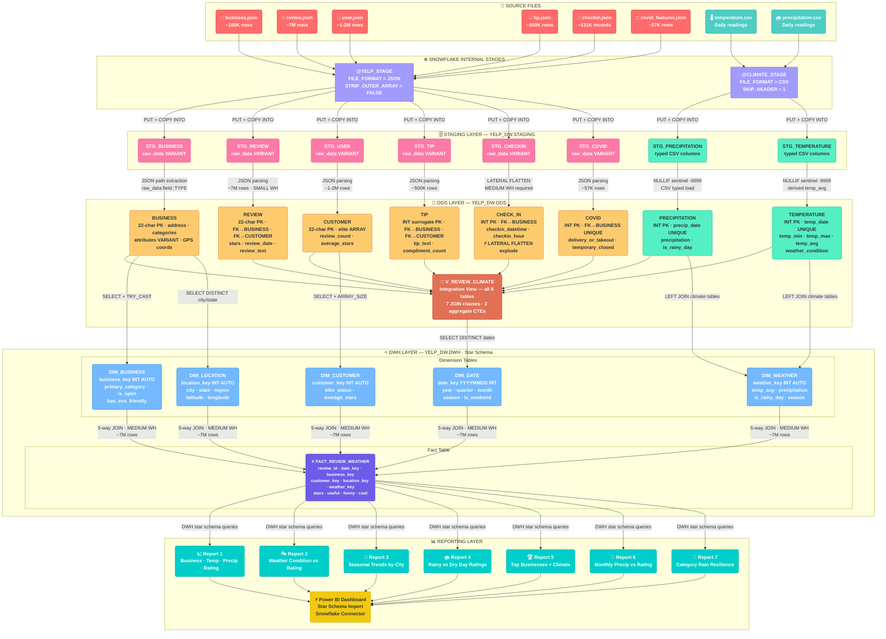

# ❄️ Yelp + Climate Data Warehouse — Snowflake Native Cloud

<div align="center">


**A production-grade, 3-layer cloud data warehouse integrating 7 million Yelp reviews with NOAA climate data to uncover the relationship between weather and customer ratings.**

[Architecture](#-architecture) • [Datasets](#-datasets) • [Schema Design](#-schema-design) • [Setup Guide](#-setup-guide) • [Reports](#-reports--analytics) • [Cost Guide](#-warehouse-sizing--cost)

</div>

---

## 📋 Table of Contents

- [Business Problem](#-business-problem)
- [Architecture](#-architecture)
- [Datasets](#-datasets)
- [Project Structure](#-project-structure)
- [Schema Design](#-schema-design)
  - [Staging Layer](#staging-layer)
  - [ODS Layer](#ods-layer--operational-data-store)
  - [DWH Layer](#dwh-layer--star-schema)
- [Setup Guide](#-setup-guide)
- [Execution Order](#-execution-order)
- [Reports & Analytics](#-reports--analytics)
- [Warehouse Sizing & Cost](#-warehouse-sizing--cost)
- [Key Technical Decisions](#-key-technical-decisions)

---

## 🎯 Business Problem

> **"Do weather conditions — specifically rainfall and temperature — measurably influence the star ratings customers give to restaurants and local businesses on Yelp?"**

The restaurant industry is deeply weather-sensitive. Consumer decisions — whether to dine out, order delivery, and the mood with which they write post-visit reviews — are influenced by daily climate conditions. This warehouse integrates **~7 million Yelp reviews** with **NOAA daily weather records** to quantify that relationship.

### Analytical Objectives

| Objective | Description |
|-----------|-------------|
| 🌧️ Weather-Rating Correlation | Measure how precipitation and temperature affect star ratings |
| 🏢 Category Resilience | Which business types are most resilient to rainy-day rating drops |
| 📅 Seasonal Trends | Track seasonal review patterns by city and climate zone |
| 😷 COVID Impact | Quantify how pandemic restrictions affected post-reopening ratings |
| 📍 Geographic Analysis | Map rating patterns by city, state, and region |
| ⏰ Traffic Patterns | Correlate check-in foot traffic with daily weather conditions |

---

## 🏗️ Architecture

The pipeline follows a **classic Medallion (3-layer) architecture** implemented natively on Snowflake, flowing from raw source files through increasingly refined layers to Power BI reporting.



### Layer Summary

| Layer | Schema | Purpose | Warehouse Size |
|-------|--------|---------|---------------|
| **Source** | Local / S3 | Raw JSON & CSV files — 8 total, ~9 GB uncompressed | — |
| **Staging** | `YELP_DW.STAGING` | Immutable raw landing zone; JSON as `VARIANT`, no transformation | X-SMALL |
| **ODS** | `YELP_DW.ODS` | Typed, normalised relational tables; JSON parsed; climate enriched; 8-table integration view | X-SMALL → MEDIUM |
| **DWH** | `YELP_DW.DWH` | Kimball star schema; 5 dimensions + 1 fact; surrogate integer keys; OLAP-optimised | X-SMALL → MEDIUM |
| **Reporting** | Power BI | 7 SQL reports + interactive dashboard via Snowflake Connector | SMALL |

---

## 📦 Datasets

### Yelp Open Dataset (6 JSON files · NDJSON format)

| File | Rows (approx.) | Key Fields |
|------|---------------|------------|
| `yelp_academic_dataset_business.json` | ~57K–150K | `business_id`, `name`, `city`, `state`, `stars`, `categories`, `attributes`, `hours` |
| `yelp_academic_dataset_review.json` | **~7,000,000** | `review_id`, `user_id`, `business_id`, `stars`, `text`, `date` |
| `yelp_academic_dataset_user.json` | ~1–2M | `user_id`, `name`, `review_count`, `yelping_since`, `elite`, `average_stars` |
| `yelp_academic_dataset_tip.json` | ~500K | `user_id`, `business_id`, `text`, `date`, `compliment_count` |
| `yelp_academic_dataset_checkin.json` | ~131K records → millions of events | `business_id`, `date` (comma-separated timestamps) |
| `yelp_academic_dataset_covid_features.json` | ~57K | `business_id`, `highlights`, `delivery_or_takeout`, `temporary_closed` |

> 🔗 Download: [Yelp Open Dataset](https://www.yelp.com/dataset)

### NOAA Climate Data (2 CSV files)

| File | Key Fields | Notes |
|------|-----------|-------|
| `precipitation.csv` | `date`, `precipitation` (inches), `precipitation_normal` | `-9999` sentinel for missing values → converted to `NULL` in ODS |
| `temperature.csv` | `date`, `min`, `max`, `normal_min`, `normal_max` (°F) | `-9999` sentinel cleaning; `temp_avg` derived as `(min+max)/2` |

> 🔗 Download: [NOAA Daily Summaries](https://www.ncei.noaa.gov/products/land-based-station/local-climatological-data)

---

## 📁 Project Structure

```
yelp-climate-dw/
│
├── sql/
│   └── Yelp_Climate_DW_Snowflake_Final.sql    # Complete pipeline (all sections)
│
├── README.md                                   # This file
│
└── docs/
    ├── DW_Design_Report.docx                   # Full project design report
    └── design_report.docx                      # Supporting screenshots & diagrams
```

### SQL Script Sections

| Section | Description | Warehouse Size |
|---------|-------------|---------------|
| `0` | Environment Setup — database, schemas, virtual warehouse | X-SMALL |
| `A` | Staging Layer — named stages + `COPY INTO` for all 8 files | X-SMALL |
| `B1` | ODS Table Creation — 8 normalised tables with PKs/FKs | X-SMALL |
| `B2` | ODS JSON Parsing — `VARIANT` → typed columns via JSON path operators | X-SMALL → MEDIUM |
| `B3` | ODS Climate Load — parse CSVs, clean `-9999` sentinels, derive `temp_avg` | X-SMALL |
| `B4` | ODS Integration View — `V_REVIEW_CLIMATE` joining all 8 ODS tables | X-SMALL (DDL only) |
| `C1` | DWH Dimension Tables — 5 dimension tables populated | X-SMALL |
| `C2` | DWH Fact Table — `FACT_REVIEW_WEATHER` via 5-way JOIN on 7M rows | **MEDIUM** |
| `C3` | Reports — 7 analytical SQL reports for Power BI | SMALL |

---

## 🗂️ Schema Design

### Staging Layer

All six Yelp staging tables follow a uniform two-column pattern:

```sql
CREATE OR REPLACE TABLE YELP_DW.STAGING.STG_BUSINESS (
    raw_data   VARIANT,                                    -- Full JSON object, untouched
    load_ts    TIMESTAMP_NTZ DEFAULT CURRENT_TIMESTAMP()  -- Audit ingestion timestamp
);
```

| Column | Type | Purpose |
|--------|------|---------|
| `raw_data` | `VARIANT` | Complete JSON object stored as Snowflake's native semi-structured type |
| `load_ts` | `TIMESTAMP_NTZ` | Auto-stamped at `COPY INTO` time for data lineage and audit trails |

Climate tables use typed `VARCHAR`/`FLOAT` columns matching the CSV structure — no sentinel cleaning at this layer.

---

### ODS Layer — Operational Data Store

Eight normalised relational tables in Third Normal Form (3NF) with explicit primary and foreign keys.

#### Entity Relationships

```
BUSINESS ◄─────── REVIEW ────────► CUSTOMER
    │                                    │
    ├──── CHECK_IN                        └──── TIP ──────► BUSINESS
    │
    └──── COVID (1:1)

TEMPERATURE ─── joined via ───► REVIEW (review_date = temp_date)
PRECIPITATION ── joined via ───► REVIEW (review_date = precip_date)
```

#### ODS Table Reference

<details>
<summary><strong>BUSINESS</strong> — ~57K–150K rows</summary>

| Column | Type | Notes |
|--------|------|-------|
| `business_id` | `VARCHAR(22)` PK | 22-char Yelp natural key |
| `name` | `VARCHAR(255)` | Business display name |
| `city`, `state`, `postal_code` | `VARCHAR` | Geographic fields |
| `latitude`, `longitude` | `FLOAT` | GPS coordinates for map visualisation |
| `stars` | `FLOAT` | Lifetime average (0.5 increments) |
| `review_count` | `INT` | Total reviews on Yelp |
| `is_open` | `BOOLEAN` | Current operating status |
| `categories` | `ARRAY` | e.g. `['Restaurants', 'Mexican']` |
| `attributes` | `VARIANT` | Nested JSON (WiFi, parking, reservations…) |
| `hours` | `VARIANT` | Nested JSON operating hours by day |
</details>

<details>
<summary><strong>CUSTOMER</strong> — ~1–2M rows</summary>

| Column | Type | Notes |
|--------|------|-------|
| `user_id` | `VARCHAR(22)` PK | 22-char Yelp natural key |
| `name` | `VARCHAR(255)` | Display name |
| `review_count` | `INT` | Lifetime review count |
| `yelping_since` | `DATE` | Member since date |
| `fans` | `INT` | Follower count |
| `average_stars` | `FLOAT` | Lifetime average rating given |
| `elite` | `ARRAY` | Years with Elite status e.g. `[2019, 2020]` |
</details>

<details>
<summary><strong>REVIEW</strong> — ~7M rows (largest table)</summary>

| Column | Type | Notes |
|--------|------|-------|
| `review_id` | `VARCHAR(22)` PK | Unique review identifier |
| `user_id` | `VARCHAR(22)` FK → CUSTOMER | |
| `business_id` | `VARCHAR(22)` FK → BUSINESS | |
| `stars` | `INT` | 1–5 star rating |
| `review_date` | `DATE` | **Temporal JOIN key** to climate tables |
| `review_text` | `TEXT` | Full review — primary memory driver at insert |
| `useful`, `funny`, `cool` | `INT` | Social vote counts |
</details>

<details>
<summary><strong>TIP</strong> — ~500K rows</summary>

| Column | Type | Notes |
|--------|------|-------|
| `tip_id` | `INT AUTOINCREMENT` PK | Surrogate key (no natural ID in source) |
| `business_id` | `VARCHAR(22)` FK → BUSINESS | |
| `user_id` | `VARCHAR(22)` FK → CUSTOMER | |
| `tip_text` | `TEXT` | Short tip/suggestion text |
| `tip_date` | `DATE` | Date written |
| `compliment_count` | `INT` | Likes received |
</details>

<details>
<summary><strong>CHECK_IN</strong> — millions of rows after FLATTEN</summary>

| Column | Type | Notes |
|--------|------|-------|
| `checkin_id` | `INT AUTOINCREMENT` PK | Generated after LATERAL FLATTEN |
| `business_id` | `VARCHAR(22)` FK → BUSINESS | |
| `checkin_datetime` | `TIMESTAMP_NTZ` | Full timestamp of individual check-in event |
| `checkin_date` | `DATE` | Date portion for aggregation |
| `checkin_hour` | `INT` | Hour 0–23 for peak-traffic analysis |
| `day_of_week` | `VARCHAR(10)` | e.g. `'Mon'`, `'Sat'` |

> ⚠️ **Requires MEDIUM warehouse** — source stores all timestamps as a single comma-separated string per business; `LATERAL FLATTEN` with `SPLIT_TO_TABLE` explodes these into individual rows.
</details>

<details>
<summary><strong>COVID</strong> — ~57K rows (1:1 with BUSINESS)</summary>

| Column | Type | Notes |
|--------|------|-------|
| `covid_id` | `INT AUTOINCREMENT` PK | |
| `business_id` | `VARCHAR(22)` UNIQUE FK → BUSINESS | `UNIQUE` enforces 1:1 cardinality |
| `delivery_or_takeout` | `BOOLEAN` | Offered delivery/takeout during COVID |
| `grubhub_enabled` | `BOOLEAN` | Available on Grubhub |
| `temporary_closed` | `BOOLEAN` | Temporarily closed |
| `virtual_services` | `BOOLEAN` | Offered virtual/online services |
</details>

<details>
<summary><strong>PRECIPITATION</strong> — thousands of rows</summary>

| Column | Type | Notes |
|--------|------|-------|
| `precip_id` | `INT AUTOINCREMENT` PK | |
| `precip_date` | `DATE` UNIQUE | One row per calendar date |
| `precipitation` | `FLOAT` | Measured inches; `NULLIF(-9999)` applied |
| `precipitation_normal` | `FLOAT` | 30-year historical average |
| `is_rainy_day` | `BOOLEAN` | `TRUE` if `precipitation > 0` |
</details>

<details>
<summary><strong>TEMPERATURE</strong> — thousands of rows</summary>

| Column | Type | Notes |
|--------|------|-------|
| `temp_id` | `INT AUTOINCREMENT` PK | |
| `temp_date` | `DATE` UNIQUE | One row per calendar date |
| `temp_min`, `temp_max` | `FLOAT` | Daily low/high °F; `-9999` → `NULL` |
| `normal_min`, `normal_max` | `FLOAT` | 30-year historical averages |
| `temp_avg` | `FLOAT` | Derived: `(temp_min + temp_max) / 2` |
| `weather_condition` | `VARCHAR(50)` | `Warm` / `Mild` / `Cold` / `Freezing` / `Extreme Heat` |
</details>

#### ODS Integration View — `V_REVIEW_CLIMATE`

The integration view joins **all 8 ODS tables** into a single analytical surface using 7 explicit JOIN clauses:

```sql
CREATE OR REPLACE VIEW YELP_DW.ODS.V_REVIEW_CLIMATE AS
WITH ci_agg AS (
    -- Pre-aggregate CHECK_IN to (business_id, date) to prevent row fan-out
    SELECT business_id, checkin_date,
           COUNT(*) AS checkin_count,
           MODE(checkin_hour) AS peak_checkin_hour
    FROM YELP_DW.ODS.CHECK_IN
    GROUP BY business_id, checkin_date
),
tip_agg AS (
    -- Deduplicate TIP to one row per (user_id, business_id, tip_date)
    SELECT user_id, business_id, tip_date,
           MAX(compliment_count) AS tip_compliments,
           MAX(tip_text)         AS tip_text
    FROM YELP_DW.ODS.TIP
    GROUP BY user_id, business_id, tip_date
)
SELECT r.*, b.*, c.*, t.*, p.*, cv.*, ci.*, tip.*
FROM            YELP_DW.ODS.REVIEW        r
    INNER JOIN  YELP_DW.ODS.BUSINESS      b   ON  r.business_id = b.business_id        -- ① Exclude orphaned reviews
    LEFT JOIN   YELP_DW.ODS.CUSTOMER      c   ON  r.user_id     = c.user_id             -- ② Retain deleted accounts
    LEFT JOIN   YELP_DW.ODS.TEMPERATURE   t   ON  r.review_date = t.temp_date           -- ③ Climate date join
    LEFT JOIN   YELP_DW.ODS.PRECIPITATION p   ON  r.review_date = p.precip_date         -- ④ Climate date join
    LEFT JOIN   YELP_DW.ODS.COVID         cv  ON  r.business_id = cv.business_id        -- ⑤ Pre-pandemic = no record
    LEFT JOIN   ci_agg                    ci  ON  r.business_id = ci.business_id        -- ⑥ Two-key temporal join
                                              AND r.review_date = ci.checkin_date
    LEFT JOIN   tip_agg                   tip ON  r.user_id     = tip.user_id           -- ⑦ Three-key join (user+biz+date)
                                              AND r.business_id = tip.business_id
                                              AND r.review_date = tip.tip_date;
```

| Join # | Table | Keys | Type | Reason |
|--------|-------|------|------|--------|
| ① | BUSINESS | `business_id` | INNER | Exclude reviews with no valid business |
| ② | CUSTOMER | `user_id` | LEFT | Deleted accounts → retain review with NULL profile |
| ③ | TEMPERATURE | `review_date = temp_date` | LEFT | Date gaps in climate data must not drop reviews |
| ④ | PRECIPITATION | `review_date = precip_date` | LEFT | Same reason as temperature |
| ⑤ | COVID | `business_id` | LEFT | Pre-pandemic listings have no COVID record |
| ⑥ | CHECK_IN (agg) | `business_id` + `review_date` | LEFT | Two-key join pins aggregate to exact review day |
| ⑦ | TIP (agg) | `user_id` + `business_id` + `review_date` | LEFT | Three-key join prevents fan-out; tip on same day as review |

---

### DWH Layer — Star Schema

A classic **Kimball star schema** with one central fact table and five conformed dimension tables, connected via integer surrogate keys.

```
                    ┌─────────────┐
                    │  DIM_DATE   │
                    │ date_key PK │
                    └──────┬──────┘
                           │
┌──────────────┐    ┌──────┴──────────────┐    ┌────────────────┐
│ DIM_BUSINESS │    │  FACT_REVIEW_WEATHER│    │  DIM_CUSTOMER  │
│business_key  ├────┤  review_id          ├────┤ customer_key   │
│   PK         │    │  date_key    FK      │    │    PK          │
└──────────────┘    │  business_key FK     │    └────────────────┘
                    │  customer_key FK     │
┌──────────────┐    │  location_key FK     │    ┌────────────────┐
│ DIM_LOCATION │    │  weather_key  FK     │    │  DIM_WEATHER   │
│location_key  ├────┤  stars               ├────┤  weather_key   │
│    PK        │    │  useful · funny      │    │     PK         │
└──────────────┘    │  cool                │    └────────────────┘
                    └─────────────────────┘
```

#### Dimension Tables

| Dimension | Surrogate Key | Grain | Key Attributes |
|-----------|---------------|-------|---------------|
| `DIM_DATE` | `date_key` (YYYYMMDD INT) | One row per unique review date | `year`, `quarter`, `month_name`, `day_of_week`, `is_weekend`, `season` |
| `DIM_BUSINESS` | `business_key` (INT AUTO) | One row per Yelp business | `business_name`, `primary_category`, `is_open`, `has_eco_friendly` |
| `DIM_CUSTOMER` | `customer_key` (INT AUTO) | One row per Yelp user | `customer_name`, `yelping_since`, `elite_status`, `average_stars` |
| `DIM_LOCATION` | `location_key` (INT AUTO) | One row per city+state+ZIP | `city`, `state`, `region`, `latitude`, `longitude` |
| `DIM_WEATHER` | `weather_key` (INT AUTO) | One row per date with climate data | `temp_avg`, `weather_condition`, `precipitation`, `is_rainy_day`, `season` |

#### Fact Table — `FACT_REVIEW_WEATHER`

| Column | Type | Role |
|--------|------|------|
| `review_id` | `VARCHAR(22)` | Degenerate dimension — natural Yelp key for traceability |
| `date_key` | `INT` FK → `DIM_DATE` | YYYYMMDD format; directly calculable from any `DATE` |
| `business_key` | `INT` FK → `DIM_BUSINESS` | |
| `customer_key` | `INT` FK → `DIM_CUSTOMER` | |
| `location_key` | `INT` FK → `DIM_LOCATION` | Derived from business's city/state/ZIP |
| `weather_key` | `INT` FK → `DIM_WEATHER` | `NULL` where no climate data available for review date |
| `stars` | `INT` | ⭐ Primary measure — 1–5 star rating |
| `useful` | `INT` | Additive social engagement measure |
| `funny` | `INT` | Additive social engagement measure |
| `cool` | `INT` | Additive social engagement measure |

---

## 🚀 Setup Guide

### Prerequisites

- Snowflake account with `ACCOUNTADMIN` or `SYSADMIN` role
- [SnowSQL CLI](https://developers.snowflake.com/snowsql/) installed (required for `PUT` commands)
- Yelp Open Dataset files downloaded locally
- NOAA climate CSV files downloaded locally

### Step 1 — Connect via SnowSQL

```bash
# Install SnowSQL, then connect:
snowsql -a <account_identifier> -u <username>
# You will be prompted for your password

# Account identifier format:
# Classic URL: https://xy12345.snowflakecomputing.com  → xy12345
# Snowsight URL: https://app.snowflake.com/us-east-1/xy12345/ → xy12345.us-east-1
```

### Step 2 — Upload Source Files to Stages

```sql
-- Run all PUT commands from SnowSQL CLI (NOT from Snowsight UI)

-- Yelp JSON files
PUT file:///path/to/yelp_academic_dataset_business.json     @YELP_DW.STAGING.YELP_STAGE    AUTO_COMPRESS=TRUE OVERWRITE=TRUE PARALLEL=4;
PUT file:///path/to/yelp_academic_dataset_review.json       @YELP_DW.STAGING.YELP_STAGE    AUTO_COMPRESS=TRUE OVERWRITE=TRUE PARALLEL=16;
PUT file:///path/to/yelp_academic_dataset_user.json         @YELP_DW.STAGING.YELP_STAGE    AUTO_COMPRESS=TRUE OVERWRITE=TRUE PARALLEL=16;
PUT file:///path/to/yelp_academic_dataset_tip.json          @YELP_DW.STAGING.YELP_STAGE    AUTO_COMPRESS=TRUE OVERWRITE=TRUE PARALLEL=8;
PUT file:///path/to/yelp_academic_dataset_checkin.json      @YELP_DW.STAGING.YELP_STAGE    AUTO_COMPRESS=TRUE OVERWRITE=TRUE PARALLEL=4;
PUT file:///path/to/yelp_academic_dataset_covid_features.json @YELP_DW.STAGING.YELP_STAGE  AUTO_COMPRESS=TRUE OVERWRITE=TRUE PARALLEL=4;

-- Climate CSV files
PUT file:///path/to/precipitation.csv  @YELP_DW.STAGING.CLIMATE_STAGE  AUTO_COMPRESS=TRUE OVERWRITE=TRUE PARALLEL=4;
PUT file:///path/to/temperature.csv    @YELP_DW.STAGING.CLIMATE_STAGE  AUTO_COMPRESS=TRUE OVERWRITE=TRUE PARALLEL=4;
```

> 💡 **PARALLEL tuning guide:**
> - `< 500 MB` → `PARALLEL=4` (default)
> - `500 MB – 2 GB` → `PARALLEL=8`
> - `2 GB – 5 GB` → `PARALLEL=16` (use for `review.json` and `user.json`)
> - Cap at your machine's CPU core count

### Step 3 — Execute the SQL Script

Run sections in strict order from Snowsight or SnowSQL:

```
Section 0  →  Section A  →  Section B1  →  Section B2  →  Section B3
→  Section B4  →  Section C1  →  Section C2  →  Section C3
```

---

## ▶️ Execution Order

```
0  ── Environment Setup (X-SMALL)
│       CREATE WAREHOUSE YELP_WH
│       CREATE DATABASE YELP_DW
│       CREATE SCHEMA STAGING / ODS / DWH
│
A  ── Staging Layer (X-SMALL)
│       CREATE STAGE YELP_STAGE, CLIMATE_STAGE
│       COPY INTO all 8 staging tables
│
B1 ── ODS Table Creation (X-SMALL — DDL only)
│       CREATE TABLE: BUSINESS, CUSTOMER, REVIEW, TIP,
│                     CHECK_IN, COVID, PRECIPITATION, TEMPERATURE
│
B2 ── ODS JSON Parsing (Mixed — ALTER WAREHOUSE embedded)
│       BUSINESS  → X-SMALL  (~57K–150K rows, simple JSON)
│       CUSTOMER  → X-SMALL  (~1–2M rows)
│       REVIEW    → SMALL ⬆️  (~7M rows + large TEXT fields)
│       TIP       → X-SMALL ⬇️ (~500K rows)
│       CHECK_IN  → MEDIUM ⬆️ (LATERAL FLATTEN — huge intermediate)
│       COVID     → X-SMALL ⬇️ (~57K rows)
│
B3 ── ODS Climate Load (X-SMALL)
│       PRECIPITATION: NULLIF(-9999), is_rainy_day flag
│       TEMPERATURE:   NULLIF(-9999), temp_avg derived, weather_condition
│
B4 ── ODS Integration View (X-SMALL — DDL only)
│       CREATE VIEW V_REVIEW_CLIMATE
│       7 JOINs across all 8 ODS tables
│
C1 ── DWH Dimension Tables (X-SMALL)
│       DIM_DATE, DIM_BUSINESS, DIM_CUSTOMER, DIM_LOCATION, DIM_WEATHER
│
C2 ── DWH Fact Table (MEDIUM ⬆️)
│       INSERT FACT_REVIEW_WEATHER — 5-way JOIN on ~7M base rows
│       ALTER WAREHOUSE → X-SMALL ⬇️ immediately after
│
C3 ── Reports (SMALL)
        Reports 1–7 — run or save as VIEWs for Power BI
```

---

## 📊 Reports & Analytics

Seven SQL reports are implemented against the DWH star schema, all queryable directly or saved as Snowflake VIEWs for Power BI:

| # | Report Name | Key Business Question | Primary Metrics |
|---|-------------|----------------------|-----------------|
| 1 | Business · Temperature · Precipitation · Ratings | What climate conditions existed on each business's review days? | `avg_temp_f`, `avg_precip_inches`, `avg_stars` |
| 2 | Weather Condition Impact on Average Rating | Do warm days drive higher ratings than cold or rainy days? | `weather_condition`, `is_rainy_day`, `avg_stars` |
| 3 | Seasonal Rating Trends by City | Which cities show the strongest seasonal rating swings? | `city`, `season`, `avg_stars`, `avg_precip` |
| 4 | Rainy Day vs Dry Day Rating Comparison | Is the mean star rating on rainy days statistically lower? | `is_rainy_day`, `avg_stars`, `avg_temp_f` |
| 5 | Top Businesses by Rating with Climate Context | Which businesses consistently earn top ratings despite weather? | `business_name`, `avg_rating`, `pct_reviews_on_rainy_days` |
| 6 | Monthly Precipitation vs Average Rating Trend | Is there a monthly correlation between rainfall and ratings? | `month_name`, `total_monthly_precip`, `avg_rating` |
| 7 | Category Resilience to Rain | Which categories are most weather-resilient? | `primary_category`, `is_rainy_day`, `avg_rating` |

### Power BI Connection

```
Host:     <account>.snowflakecomputing.com
Database: YELP_DW
Schema:   DWH
Tables:   FACT_REVIEW_WEATHER + all 5 DIM tables
Mode:     Import (recommended for dashboard performance)
```

Set star schema relationships in Power BI Model view using the surrogate keys (`date_key`, `business_key`, `customer_key`, `location_key`, `weather_key`).

---

## 💰 Warehouse Sizing & Cost

### Per-Operation Sizing Guide

| Operation | Recommended Size | Reason |
|-----------|-----------------|--------|
| All `CREATE` DDL statements | **X-SMALL** | Metadata-only; zero data scanned |
| All `COPY INTO` staging loads | **X-SMALL** | File-level parallelism; upsizing adds no speed benefit |
| ODS: `BUSINESS`, `CUSTOMER`, `TIP`, `COVID` | **X-SMALL** | Row counts < 2M; simple JSON extraction |
| ODS: `REVIEW` insert | **SMALL** | ~7M rows + large `TEXT` fields need memory bandwidth |
| ODS: `CHECK_IN` FLATTEN | **MEDIUM** | `LATERAL FLATTEN` produces massive intermediate result set |
| DWH: All 5 dimension tables | **X-SMALL** | Small distinct sets; fits in 16 GB RAM |
| DWH: `FACT_REVIEW_WEATHER` insert | **MEDIUM** | 5-way hash JOIN on 7M base rows |
| Report queries / Power BI refresh | **SMALL** | Aggregate queries on indexed star schema |

### Estimated Credit Cost — One Full Pipeline Run

| Phase | Size | Duration | Credits |
|-------|------|----------|---------|
| Staging loads | X-SMALL | ~15 min | ≈ 0.25 |
| ODS REVIEW insert | SMALL | ~10 min | ≈ 0.33 |
| ODS CHECK_IN FLATTEN | MEDIUM | ~20 min | ≈ 1.33 |
| ODS other inserts | X-SMALL | ~5 min | ≈ 0.08 |
| DWH dimension inserts | X-SMALL | ~5 min | ≈ 0.08 |
| DWH FACT insert | MEDIUM | ~15 min | ≈ 1.00 |
| Reports & verification | SMALL | ~10 min | ≈ 0.33 |
| **TOTAL** | | **~80 min** | **≈ 3.5–5.0** |

> ⚡ **Cost tip:** The warehouse auto-suspends after 300 seconds (5 min) of inactivity. Always downsize to X-SMALL immediately after each MEDIUM phase to avoid burning credits while idle.

---

## 🔧 Key Technical Decisions

### Why Snowflake `VARIANT` for JSON?
Snowflake's native `VARIANT` type stores semi-structured JSON without any schema enforcement at load time. This means all 6 Yelp JSON files can be ingested via `COPY INTO` without defining every field upfront — fields are parsed only at query time using `raw_data:field_name::TYPE` syntax, giving full schema-on-read flexibility.

### Why `LATERAL FLATTEN` for Check-ins?
The Yelp check-in source stores every check-in timestamp for a single business as one comma-separated string (e.g. `"2019-03-19 23:51:00, 2019-04-03 23:22:00, ..."`). `LATERAL FLATTEN(INPUT => SPLIT_TO_TABLE(...))` explodes this into individual rows — one per check-in event — which is the only way to enable temporal aggregation and day-level joining to the review table.

### Why Surrogate Keys in the DWH?
Natural Yelp keys are 22-character `VARCHAR` strings. Joining on `VARCHAR` in large fact-table queries is significantly slower than joining on `INT` in Snowflake's columnar engine. Surrogate integer keys also decouple the DWH from upstream source key changes and are required for Power BI's import-mode relationship model to function correctly.

### Why `NULLIF(-9999)` in the ODS?
NOAA uses `-9999` as a sentinel value for missing sensor readings. If these values are stored as numbers, they corrupt every aggregate (`AVG`, `MIN`, `MAX`, `SUM`) that includes them. Replacing with SQL `NULL` ensures missing readings are automatically excluded from aggregations rather than distorting results.

### Why Two CTEs in `V_REVIEW_CLIMATE`?
`CHECK_IN` has one row per event (after FLATTEN); directly joining it to `REVIEW` (also one row per review) would multiply rows wherever multiple check-ins existed on the same business/date. The `ci_agg` CTE pre-collapses to one row per `(business_id, checkin_date)` before the join, preserving the one-review-per-row grain of the view. The same fan-out risk exists for `TIP` and is handled by `tip_agg`.

---

## 📚 References

- [Yelp Open Dataset](https://www.yelp.com/dataset)
- [NOAA Daily Summaries](https://www.ncei.noaa.gov/products/land-based-station/local-climatological-data)
- [Snowflake Documentation — Semi-Structured Data](https://docs.snowflake.com/en/user-guide/semi-structured-intro)
- [Snowflake Documentation — LATERAL FLATTEN](https://docs.snowflake.com/en/sql-reference/functions/flatten)
- [Snowflake Documentation — Virtual Warehouses](https://docs.snowflake.com/en/user-guide/warehouses-overview)
- [Power BI Snowflake Connector](https://learn.microsoft.com/en-us/power-bi/connect-data/desktop-connect-snowflake)
- Kimball, R. & Ross, M. (2013). *The Data Warehouse Toolkit* (3rd ed.). Wiley.

---

<div align="center">

**Built with ❄️ Snowflake · 📊 Power BI · 🐍 SQL**

*Yelp Open Dataset + NOAA Climate Data Integration*

</div>
